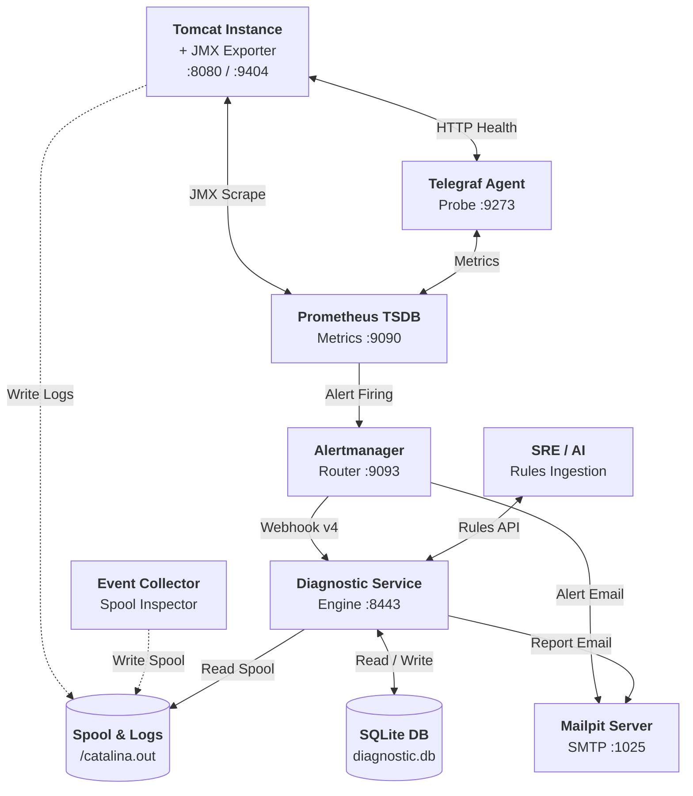

# Tomcat Monitoring & Diagnostic Automation

Repository ini berisi konfigurasi, automasi deployment, manajemen aturan deklaratif, serta interface verifikasi otomatis untuk ekosistem **Tomcat Monitoring & Diagnostic Platform**.

Stack pemantauan ini mengintegrasikan pengumpulan metrik runtime (JMX & HTTP Health), perutean alert cerdas (Alertmanager), serta analisis diagnosis otonom (*Autonomous Diagnostic Engine*) yang diperkaya oleh kecerdasan buatan (*AI-Augmented Knowledge Enrichment*).

---

## 🏛️ Topologi Arsitektur Ekosistem



### 📋 Deskripsi Komponen Utama

1. **`tomcat-jmx-exporter`:** Tomcat Instance yang dilengkapi Java Agent JMX Exporter (port 9404 HTTPS) untuk metrik JVM dan Tomcat MBeans, serta port 8080 HTTP untuk traffic aplikasi dan probe endpoint `/health`.
2. **`telegraf`:** Local HTTP health probe untuk aplikasi Tomcat (`/health`) (port 9273).
3. **`prometheus`:** Time-series TSDB, scraping JMX & Telegraf, serta evaluasi alert rules (`TomcatDown`) (port 9090).
4. **`alertmanager`:** Routing webhook cerdas ke Diagnostic Service dan email firing/resolved ke Mailpit (port 9093).
5. **`diagnostic-service`:** Core Autonomous Diagnostic Engine dengan 18 cabang diagnosis (*TD-01 s/d TD-18*) dan Rules API (port 8443).
6. **`event-collector`:** Restricted Event Collector yang membaca state container Tomcat, exit code, dan crash artifacts ke partisi spool.
7. **`mailpit`:** Local SMTP receiver dan Web UI untuk pengujian dan verifikasi laporan diagnosis (port 8025/1025).

---

## 📑 Taksonomi Kategori Domain Kegagalan (Failure Domains)

Sistem mengadopsi taksonomi **8 Kategori Domain Kegagalan** untuk menstrukturkan basis pengetahuan diagnosis dan mempermudah perutean eskalasi:

| Kategori Domain (*Category Enum*) | Definisi & Cakupan Kegagalan | Pola & Gejala Tipikal (*Typical Patterns*) | Tim Eskalasi / Triage Target |
| :--- | :--- | :--- | :--- |
| **`jvm_memory`** | Kegagalan alokasi memori internal JVM, class metadata, atau batas garbage collector. | `OutOfMemoryError: Java heap space`, `Metaspace`, `GC overhead limit exceeded`, `Direct buffer memory`. | Tim Backend / Java Developer |
| **`concurrency_threading`** | Kejenuhan worker thread pool Tomcat, thread starvation, atau kondisi saling kunci (*deadlock*). | `RejectedExecutionException: Thread pool is exhausted`, `Java-level deadlock`, thread saturation. | Tim Backend / Platform Engineer |
| **`database_persistence`** | Kegagalan konektivitas, exhaustion connection pool database, timeout query, atau deadlock database. | `CannotGetJdbcConnectionException`, `HikariPool timeout`, `SQLTimeoutException`, connection leak. | Tim DBA / Database Administrator |
| **`network_integration`** | Kegagalan jabat tangan TLS/SSL, timeout komunikasi microservice upstream, atau DNS/socket failure. | `SSLHandshakeException`, `SocketTimeoutException: Read timed out`, `ConnectException: Connection refused`. | Tim Network / Cloud Infrastructure |
| **`application_lifecycle`** | Kegagalan startup container, deployment WAR, inisialisasi context aplikasi, atau runtime servlet error. | `LifecycleException: Failed to start component`, `BeanCreationException`, `ClassNotFoundException`. | Tim Application Developer |
| **`storage_os_limits`** | Batasan resource OS host, exhaustion file descriptor / process limit (ulimit), atau kapasitas disk. | `Too many open files`, `No space left on device`, `Read-only file system`, exit code container tanpa dump. | Tim Sysadmin / Infrastructure |
| **`security_session`** | Kegagalan autentikasi eksternal, otorisasi, validasi token, replikasi sesi cluster, atau filter crash. | `LDAPException`, `SessionReplicationException`, `InvalidTokenException`, CORS filter crash. | Tim Security / IAM & Middleware |
| **`general`** | Kondisi cross-domain, telemetri anomali saling bertentangan, atau klasifikasi *fallback* yang belum terpetakan. | `Contradicting state`, `Undetermined evidence`, pola kegagalan baru yang memerlukan analisis AI. | SRE / Incident Commander |

---

## 📂 Struktur Repositori

```text
tomcat-monitoring/
├── config/                  Konfigurasi komponen monitoring:
│   ├── alertmanager/        Konfigurasi routing alertmanager.yml & email template
│   ├── jmx-exporter/        Spesifikasi metrik JVM & Tomcat MBeans (config.yml)
│   ├── prometheus/          Scrape targets, TLS truststore, & alert rules (TomcatDown)
│   ├── rules/               Curated master rulepacks (curated-production-rulepacks.json)
│   └── telegraf/            HTTP health check probe configuration (telegraf.conf)
├── fixtures/                Test fixtures & mock receivers:
│   ├── alertmanager-webhook-receiver/  Receiver fixture untuk integrasi webhook
│   ├── diagnostic-service-mailpit/     Mock assertions HTTPS/Mailpit/SQLite
│   └── tomcat-health-app/              Exploded JSP health endpoint application
├── scripts/                 Automasi deployment, CLI operasional, & testing:
│   ├── deploy-alertmanager.sh           Deploy Alertmanager container
│   ├── deploy-diagnostic-service.sh     Deploy Diagnostic Service container
│   ├── deploy-event-collector.sh        Deploy Restricted Event Collector
│   ├── deploy-prometheus.sh             Deploy Prometheus TSDB container
│   ├── deploy-telegraf.sh               Deploy Telegraf health agent
│   ├── deploy-tomcat-jmx-exporter.sh    Deploy Tomcat runtime target
│   ├── export-rules.sh                  CLI ekspor master catalog aturan aktif
│   ├── ingest-rule.sh                   CLI ingest rulepack (single / batch array)
│   ├── validate-ai-knowledge-lifecycle.sh Automated 3-scenario AI knowledge test suite
│   ├── validate-diagnostic-pipeline.sh    End-to-end diagnostic pipeline test suite
│   └── validate.sh                      Static layout & contract validator
└── validation/              Kumpulan skrip validator statis per komponen
```

---

## 🚀 Panduan Operasional & CLI Helper

### 1. Ingest Aturan Diagnosis Baru (Single / Batch Array)
Gunakan [`scripts/ingest-rule.sh`](file:///home/eddywiyatno/git/tomcat-monitoring/scripts/ingest-rule.sh) untuk mengimpor aturan hasil sintesis AI ke Diagnostic Service secara *hot-reload*:

```bash
# Ingest batch array proaktif
BEARER_TOKEN="test-token-12345" ./scripts/ingest-rule.sh config/rules/curated-production-rulepacks.json

# Ingest single rule JSON
BEARER_TOKEN="test-token-12345" ./scripts/ingest-rule.sh /tmp/rule-td19.json
```

### 2. Ekspor Master Catalog ke PC Lokal
Gunakan [`scripts/export-rules.sh`](file:///home/eddywiyatno/git/tomcat-monitoring/scripts/export-rules.sh) untuk mengekstrak basis pengetahuan aktif:

```bash
# Menampilkan ringkasan seluruh kategori aktif dan jumlah aturan
./scripts/export-rules.sh --categories

# Ekspor seluruh katalog aturan aktif ke berkas lokal
./scripts/export-rules.sh > ~/master-rules.json

# Ekspor aturan spesifik berdasarkan domain kategori
./scripts/export-rules.sh --category database_persistence
./scripts/export-rules.sh --category jvm_memory

# Ekspor aturan spesifik berdasarkan Branch ID
./scripts/export-rules.sh TD-10
```

---

## 🧪 Skrip Pengujian Otomatis (*Automated Verification Suites*)

Repository ini menyediakan rangkaian pengujian otomatis end-to-end:

### A. AI Knowledge Lifecycle & Rules API (3 Skenario)
Menguji Safe Hot-Ingestion (`TD-10`), 5-Layer Ingestion Defense (`401`, `400`, `409`, `413`, `405`), serta Knowledge & Forensic Data Export:
```bash
./scripts/validate-ai-knowledge-lifecycle.sh
```

### B. End-to-End Diagnostic Pipeline Verification
Menguji alur lengkap saat TomcatDown firing, korelasi bukti log, korelasi exit code, persistensi SQLite, dan pengiriman email Mailpit:
```bash
./scripts/validate-diagnostic-pipeline.sh
```

### C. Static Layout Validation
```bash
./scripts/validate.sh
```

---

## 📊 Matriks Status Implementasi

| Komponen / Pipeline | Status | Verifikasi Teknis |
| :--- | :---: | :--- |
| **JMX Exporter (HTTPS :9404)** | ✅ Selesai | TLS verification, `up=1` scrape target |
| **Telegraf Health Probe (:9273)** | ✅ Selesai | Endpoint `/health` matching `{"status":"UP"}` |
| **Prometheus (:9090)** | ✅ Selesai | Alert rule `TomcatDown` firing/resolved |
| **Alertmanager (:9093)** | ✅ Selesai | Webhook route ke Diagnostic Service & Mailpit |
| **Diagnostic Service (:8443)** | ✅ Selesai | 18 branches (`TD-01`..`TD-18`), Rules API |
| **Restricted Event Collector** | ✅ Selesai | Spool isolation, rate-limit, read-only |
| **Mailpit (:8025 / :1025)** | ✅ Selesai | Validasi email 7-seksi laporan investigasi |
| **AI Knowledge Enrichment Engine**| ✅ Selesai | 100% verified via automated lifecycle suite |

---

## 📖 Dokumentasi Terkait

* **DevOps Engineering Handbook:** [`devops-handbook/docs/projects/tomcat-monitoring/`](file:///home/eddywiyatno/git/devops-handbook/docs/projects/tomcat-monitoring/)
* **Operations Runbook:** [`devops-handbook/docs/projects/tomcat-monitoring/operations/ai-knowledge-enrichment-and-rule-management-runbook.md`](file:///home/eddywiyatno/git/devops-handbook/docs/projects/tomcat-monitoring/operations/ai-knowledge-enrichment-and-rule-management-runbook.md)
* **Engineering Journals:** [`devops-handbook/docs/projects/tomcat-monitoring/engineering-journal/`](file:///home/eddywiyatno/git/devops-handbook/docs/projects/tomcat-monitoring/engineering-journal/)
