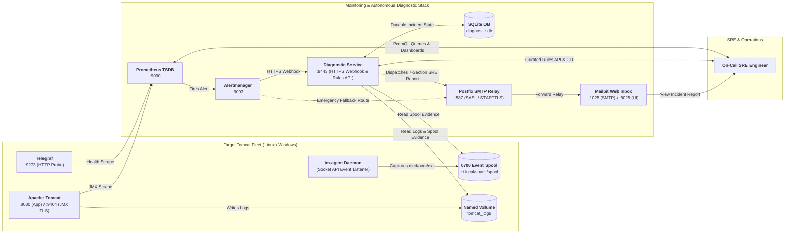
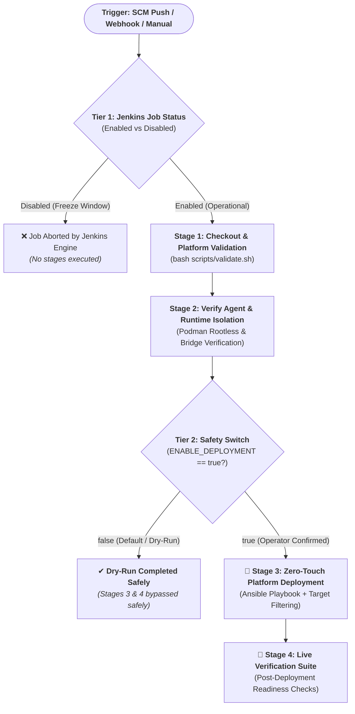

# 🚀 Tomcat Monitoring & Autonomous Diagnostic Platform

[](inventories/README.md)
[](scripts/container-runtime-helper.sh)
[](roles/README.md)
[](config/README.md)
[](CONFIG)

Welcome to the **Tomcat Monitoring & Autonomous Diagnostic Platform** repository. This repository acts as the master orchestrator for configuration, automated deployment, AI-driven diagnostic rule management, and comprehensive live verification suites. **Built as an internal and embedded solution**, this monitoring platform lives directly within the Apache Tomcat instance. By utilizing the server's existing capacity, it eliminates the need for additional infrastructure procurement, making it highly cost-efficient while remaining fully effective for all monitoring needs. This design ensures deep, low-latency observability and rapid incident recovery for enterprise environments.

The monitoring stack combines **real-time runtime metrics captured directly from the source via JMX & HTTP Probes**, **intelligent alert routing (Alertmanager)**, and an **autonomous incident diagnostic engine (*Diagnostic Service*)** backed by SRE-curated knowledge packs—with a strict **Zero Destructive Auto-Remediation** policy.

---

## 📑 Table of Contents

- [💡 Overview & Value Proposition](#-overview--value-proposition)
- [🏛️ Architecture & Component Topology](#-architecture--component-topology)
- [📦 Stack Components & Service Catalog](#-stack-components--service-catalog)
- [💾 Persistent Storage & Data Governance (Zero `/tmp` Policy)](#-persistent-storage--data-governance-zero-tmp-policy)
- [⚡ 5-Minute Quick Start](#-5-minute-quick-start)
  - [1. Prerequisites](#1-prerequisites)
  - [2. One-Command Zero-Touch Deployment](#2-one-command-zero-touch-deployment)
  - [3. Interactive Live Incident Simulation Demo](#3-interactive-live-incident-simulation-demo)
  - [4. Web UIs & Endpoint Quick Access Matrix](#4-web-uis--endpoint-quick-access-matrix)
- [🤖 Automated Fleet Provisioning & Deployment (Ansible)](#-automated-fleet-provisioning--deployment-ansible)
  - [1. Full Stack Deployment (`deploy-stack.yml`)](#1-full-stack-deployment-deploy-stackyml)
  - [2. Standalone Host Provisioning (`provision-fleet.yml`)](#2-standalone-host-provisioning-provision-fleetyml)
  - [3. Selective Single-Target / Group Deployment (`--limit`)](#3-selective-single-target--group-deployment---limit)
  - [4. Enterprise Multi-Dimensional Matrix Targeting](#4-enterprise-multi-dimensional-matrix-targeting)
  - [5. Modular Ansible Roles](#5-modular-ansible-roles)
  - [6. Intelligent Dual-Execution Ansible Runner](#6-intelligent-dual-execution-ansible-runner)
- [🛠️ Alternative Deployment Methods](#️-alternative-deployment-methods)
  - [A. Modern Declarative CLI (`tmctl`)](#a-modern-declarative-cli-tmctl)
  - [B. Modular Shell Scripts](#b-modular-shell-scripts)
- [🏭 Enterprise Container Registry Integration & Image Lifecycle](#-enterprise-container-registry-integration--image-lifecycle)
- [📊 Core Observability Metrics & SRE PromQL Cheatsheet](#-core-observability-metrics--sre-promql-cheatsheet)
- [🔧 Daily SRE Operational Runbook](#-daily-sre-operational-runbook)
  - [A. Adjusting Prometheus Retention & TSDB Quotas](#a-adjusting-prometheus-retention--tsdb-quotas)
  - [B. Dynamic AI Diagnostic Rule Management (Hot-Ingest & Export)](#b-dynamic-ai-diagnostic-rule-management-hot-ingest--export)
  - [C. Restricted Event Collector Daemon & Spool Lifecycle](#c-restricted-event-collector-daemon--spool-lifecycle)
  - [D. Managing Persistent Volumes & Catalina Runtime Logs](#d-managing-persistent-volumes--catalina-runtime-logs)
- [🧪 Automated Verification Suites](#-automated-verification-suites)
- [🚀 CI/CD Automation & Pipeline Architecture](#-cicd-automation--pipeline-architecture)
  - [1. Three-Layer Pipeline Architecture](#1-three-layer-pipeline-architecture)
  - [2. Two-Tier Defense-in-Depth Safety Mechanism](#2-two-tier-defense-in-depth-safety-mechanism)
  - [3. Jenkins UI Deployment Runbook](#3-jenkins-ui-deployment-runbook)
- [📂 Repository Structure](#-repository-structure)
- [📖 Technical References & Architecture Records](#-technical-references--architecture-records)

---

## 💡 Overview & Value Proposition

### The Operational Challenge

In enterprise environments, diagnosing production Apache Tomcat outages—such as OOM crashes, thread pool exhaustion, GC pauses, or kernel terminations—typically involves severe operational bottlenecks:

* **High Mean-Time-To-Resolution (MTTR):** On-call engineers must manually SSH into production servers to scrape logs and collect data while the system is down.
* **Fragmented Investigations:** Troubleshooting is hindered by manually hunting through scattered `catalina.out` log files and struggling to correlate timestamps across disparate systems.
* **Risk of Blind Recovery:** High probability of service disruption or data corruption caused by uncoordinated automatic container restarts executed without any root-cause analysis.

### The Solution & Design Principles

This platform automates the entire incident diagnostic lifecycle. It is built on the principles of being **Effective, Ultra-Efficient, and Highly Secure**, utilizing a **Local-First, Co-located Architecture** that resides directly on the same host as the Apache Tomcat instance:

* **Resource-Efficient Footprint:** Designed with an incredibly lightweight footprint. Since Apache Tomcat and its hosted applications typically leave remaining CPU capacity underutilized, this platform smartly harnesses those idle host resources to run monitoring and diagnostics without impacting core application performance.
* **Zero-External Data Leak (Absolute Security):** All metric collection, log analysis, and root-cause correlations are executed strictly inside the local host boundary. Because raw logs and sensitive diagnostic data never leave the internal network to external third-party platforms, enterprise data exposure risks are entirely eliminated.
* **Instant Evidence Capture & Accelerated Hypotheses:** Eliminates traditional, guesswork-driven incident responses. The moment an anomaly occurs, the platform instantly freezes and captures point-in-time digital evidence (such as thread dumps and localized log segments) providing concrete, absolute data to validate initial troubleshooting hypotheses within seconds before data is lost or overwritten by container restarts.

### Automated Incident Lifecycle Workflow

1. **Real-Time Metric Collection & Probing:** Ingests JVM MBeans locally via Prometheus JMX Exporter and verifies application liveness via Telegraf probes.
2. **Local Container Engine Event Streaming:** Captures container lifecycle events (`died`, `oom`, `stop`, exit codes) in real-time via the restricted `tm-agent` daemon into a secured local `0700` spool.
3. **Autonomous Root Cause Correlation:** When a local alert fires (`TomcatDown`, `TomcatThreadPoolSaturated`, `TomcatGCPauseHigh`), Alertmanager routes the incident immediately to the Diagnostic Service HTTPS webhook hosted on the same server.
4. **Actionable 7-Section SRE Incident Reports:** Automatically correlates fresh local metrics, spool events, and log evidence, producing a comprehensive, data-backed report dispatched via enterprise SMTP relay (Postfix/Mailpit) within seconds.
5. **Strict Safety Policy (Zero-Destructive Auto-Remediation):** Directly empowers SREs with unassailable facts and remediation runbooks, strictly avoiding dangerous, automated system state changes that could trigger data corruption.

---

## 🏛️ Architecture & Component Topology



---

## 📦 Stack Components & Service Catalog

| Component | Port / Interface | Description & Architectural Scope | Configuration Guide |
| :--- | :---: | :--- | :--- |
| **`tomcat-jmx-exporter`** | `8080` (HTTP)<br/>`9404` (HTTPS TLS) | Target Tomcat container running Java Agent JMX Exporter to expose JVM Heap, GC STW pauses, and Thread Pool metrics over TLS. | [`config/jmx-exporter/`](config/jmx-exporter/README.md) |
| **`telegraf`** | `9273` (HTTP) | Lightweight agent probing the `/health` application endpoint and exporting HTTP response codes and latencies. | [`config/telegraf/`](config/telegraf/README.md) |
| **`prometheus`** | `9090` (HTTP) | TSDB scraping engine with custom alerting rules (`TomcatDown`, `TomcatThreadPoolSaturated`, `TomcatGCPauseHigh`) and 15-day retention. | [`config/prometheus/`](config/prometheus/README.md) |
| **`alertmanager`** | `9093` (HTTP) | Alert router forwarding incidents to the Diagnostic Service HTTPS webhook, with a direct SMTP bypass for emergency fallback. | [`config/alertmanager/`](config/alertmanager/README.md) |
| **`diagnostic-service`** | `8443` (HTTPS) | Autonomous 18-branch diagnostic engine (`TD-01`..`TD-18`), durable SQLite state machine, evidence correlator, and 7-Section SRE report generator. | [`config/diagnostic-service/`](config/diagnostic-service/README.md) |
| **`postfix-relay`** | `587` (Internal) | Enterprise SMTP Relay Bridge (Pattern A) with SASL Authentication and STARTTLS encryption relaying to downstream MTAs/Mailpit. | [`config/diagnostic-service/`](config/diagnostic-service/README.md) |
| **`event-collector` (`tm-agent`)** | *Daemon* | Standalone Go daemon listening to container engine socket events (`died`, `oom`, `stop`) and writing structured JSON to a `0700` spool. | [`config/event-collector/`](config/event-collector/README.md) |
| **`tmctl`** | *CLI* | Standalone Go operator CLI for declarative container lifecycle orchestration, rule management, and stack health auditing. | Included in release tooling |
| **`mailpit`** | `8025` (Web UI)<br/>`1025` (SMTP) | Developer & Lab mock SMTP server with a full-featured web inbox for inspecting incident reports and RFC-compliant headers. | Pre-configured in stack |

---

## 💾 Persistent Storage & Data Governance (Zero `/tmp` Policy)

To ensure high availability, crash resilience, and compliance with the platform's **Zero `/tmp` Policy**, all components utilize persistent named volumes and host-isolated directories:

| Volume Name / Host Path | Container Mount Path | Access | Persistent Function & Retention Scope |
| :--- | :--- | :---: | :--- |
| **`tomcat_logs`** | `tomcat-jmx-exporter:/usr/local/tomcat/logs`<br/>`diagnostic-service:/run/tomcat-diagnostic/logs` | `rw,z`<br/>`ro,z` | Persists `catalina.out` and daily rotation logs for evidence extraction during incident diagnosis. |
| **`diagnostic_data`** | `diagnostic-service:/var/lib/tomcat-diagnostic` | `rw,z` | Durable SQLite `diagnostic.db` maintaining incident queues, dynamic AI rules, and dispatch audit history. |
| **`prometheus_data`** | `prometheus:/prometheus` | `rw,z` | Time-series TSDB data chunks and Write-Ahead Logs (WAL) with 15-day retention. |
| **`alertmanager_data`** | `alertmanager:/alertmanager` | `rw,z` | Notification logs, alert aggregation states, and active silence configurations. |
| **`~/.local/share/tomcat-monitoring/spool`** | `diagnostic-service:/run/tomcat-diagnostic/spool` | `ro,z` | Host spool directory holding container event JSON records (restricted `0700` permissions). |

---

## ⚡ 5-Minute Quick Start

Get the entire monitoring and diagnostic platform running in under 5 minutes on your local machine or server.

### 1. Prerequisites
* **Operating System:** Linux (Ubuntu, Debian, RHEL, CentOS, Rocky, Amazon Linux) or Windows Server (2022/2025).
* **Container Runtime:** Podman (rootless recommended) or Docker Engine.
* **Tools:** `git`, `bash`, `curl`, `python3`.

### 2. One-Command Zero-Touch Deployment
Clone the repository and run the master deployment playbook:

```bash
# 1. Clone repository
git clone git@github.com:edkas07-oss/tomcat-monitoring.git
cd tomcat-monitoring

# 2. Deploy complete stack in local lab mode
bash scripts/run-ansible-playbook.sh deploy-stack.yml -i inventories/lab.ini
```

> [!TIP]
> The `run-ansible-playbook.sh` runner automatically detects if Ansible is installed on the host. If Ansible is not present, it executes seamlessly inside a lightweight, containerized Ansible controller (`localhost/ansible-controller:1.0`).

### 3. Interactive Live Incident Simulation Demo
Prove that the autonomous diagnostic engine and alerting pipeline work end-to-end by running the live incident test:

```bash
# Trigger an automated TomcatDown incident simulation
bash scripts/test-tomcatdown-live.sh
```

**What happens during this test:**
1. Tomcat runtime container is stopped to simulate an outage.
2. Prometheus detects target down (`up == 0`) and fires the `TomcatDown` alert.
3. Alertmanager receives the alert and posts it to the Diagnostic Service webhook.
4. The Diagnostic Service correlates container exit evidence, extracts recent log lines, generates a **7-Section SRE Incident Investigation Report**, and sends it via the Postfix SMTP relay.
5. Tomcat is restored, Prometheus resolves the alert, and a `[RESOLVED]` notification is dispatched.

### 4. Web UIs & Endpoint Quick Access Matrix

Open your web browser and explore the stack:

| Service / Interface | URL / Endpoint | Protocol & Authentication | Description |
| :--- | :--- | :--- | :--- |
| **📬 Mailpit Web Inbox** | [`http://localhost:8025`](http://localhost:8025) | HTTP / No Auth | **View generated SRE Incident Reports** (Inspect 7-section diagnosis and RFC headers). |
| **📊 Prometheus Web UI** | [`http://localhost:9090`](http://localhost:9090) | HTTP / No Auth | Query PromQL metrics, inspect target health, and view active alert rules. |
| **🔔 Alertmanager Web UI** | [`http://localhost:9093`](http://localhost:9093) | HTTP / No Auth | Inspect alert routing tree, active alerts, and silence rules. |
| **🩺 Diagnostic Engine API** | [`https://localhost:8443/health`](https://localhost:8443/health) | HTTPS / Self-Signed TLS | Diagnostic Service liveness & readiness status. |
| **🌐 Tomcat Application** | [`http://localhost:8080`](http://localhost:8080) | HTTP | Target web application and `/health` probe endpoint. |
| **📈 Tomcat JMX Metrics** | [`https://localhost:9404/metrics`](https://localhost:9404/metrics) | HTTPS / TLS Keystore | Raw Prometheus metrics exported from JVM MBeans. |

---

## 🤖 Automated Fleet Provisioning & Deployment (Ansible)

The platform provides idempotent, production-grade automation using **Ansible Playbooks & Thin Declarative Roles** with native **Multi-OS Fact Branching** for Linux and Windows Server fleets.

> 📖 **Comprehensive Inventory Guide:** Detailed taxonomy and boolean targeting cheatsheets are documented in [`inventories/README.md`](inventories/README.md).

### 1. Full Stack Deployment (`deploy-stack.yml`)
Provisions directories, secrets, TLS material, network bridge, named volumes, installs `tm-agent` daemon, orchestrates all stack containers, and validates endpoint readiness:

```bash
# Local Lab Environment
bash scripts/run-ansible-playbook.sh deploy-stack.yml -i inventories/lab.ini

# AWS Staging Multi-OS Fleet (Linux & Windows Server)
bash scripts/run-ansible-playbook.sh deploy-stack.yml -i inventories/aws-staging.ini

# AWS Production Multi-OS Fleet
bash scripts/run-ansible-playbook.sh deploy-stack.yml -i inventories/aws-production.ini
```

### 2. Standalone Host Provisioning (`provision-fleet.yml`)
Prepares target nodes (creates secure folders, injects credentials, deploys operator `tmctl`, and starts the background `tm-agent` daemon) without launching the containerized monitoring stack:

```bash
bash scripts/run-ansible-playbook.sh provision-fleet.yml -i inventories/aws-staging.ini
```

### 3. Selective Single-Target / Group Deployment (`--limit`)
When managing large fleets and needing to update a specific host or group without touching others:

```bash
# Deploy ONLY to a specific Windows node
bash scripts/run-ansible-playbook.sh deploy-stack.yml -i inventories/aws-staging.ini --limit aws-ec2-win-01

# Deploy ONLY to a specific Linux host by IP
bash scripts/run-ansible-playbook.sh deploy-stack.yml -i inventories/aws-staging.ini --limit 198.51.100.10

# Deploy ONLY to all Windows nodes
bash scripts/run-ansible-playbook.sh deploy-stack.yml -i inventories/aws-staging.ini --limit windows_nodes

# Deploy ONLY to all Linux nodes
bash scripts/run-ansible-playbook.sh deploy-stack.yml -i inventories/aws-staging.ini --limit linux_nodes
```

### 4. Enterprise Multi-Dimensional Matrix Targeting
Using the template [`inventories/enterprise-matrix.ini.example`](inventories/enterprise-matrix.ini.example), you can target nodes across Application, Environment, and OS dimensions using Ansible Boolean logic:

```bash
# 1. Intersection (AND / &): Deploy ONLY to payment app in UAT environment
bash scripts/run-ansible-playbook.sh deploy-stack.yml -i inventories/enterprise-matrix.ini.example --limit "app_payment:&env_uat"

# 2. Intersection (AND / &): Deploy ONLY to Windows nodes in Production
bash scripts/run-ansible-playbook.sh deploy-stack.yml -i inventories/enterprise-matrix.ini.example --limit "windows_nodes:&env_production"

# 3. Union (OR / :): Deploy to DEV and SIT environments simultaneously
bash scripts/run-ansible-playbook.sh deploy-stack.yml -i inventories/enterprise-matrix.ini.example --limit "env_dev:env_sit"

# 4. Negation (NOT / !): Deploy to all Production nodes EXCEPT Site B
bash scripts/run-ansible-playbook.sh deploy-stack.yml -i inventories/enterprise-matrix.ini.example --limit "env_production:!env_siteprodB"
```

### 5. Modular Ansible Roles
* **[`role_host_prep`](roles/role_host_prep/):** Initializes directory permissions (`0700` Linux / `C:\monitoring` Windows), materializes TLS certificates (`0400`), creates bridge networks, and prepares persistent volumes.
* **[`role_event_collector`](roles/role_event_collector/):** Manages `tm-agent` background daemon installation (`systemd --user` on Linux, Windows background service).
* **[`role_container_stack`](roles/role_container_stack/):** Thin declarative orchestrator reconciling monitoring containers (Mailpit, Postfix, Tomcat, Prometheus, Alertmanager, Diagnostic Service) using `tmctl stack deploy`.

### 6. Intelligent Dual-Execution Ansible Runner
`scripts/run-ansible-playbook.sh` automatically evaluates the host environment:
* **Native Mode:** Executes directly if `ansible-playbook` is found on the host.
* **Containerized Mode:** Automatically spawns `localhost/ansible-controller:1.0` with `--network host` and socket mounting if Ansible is not installed locally.

---

## 🛠️ Alternative Deployment Methods

### A. Modern Declarative CLI (`tmctl`)
```bash
# Deploy full stack with automated readiness verification
tmctl stack deploy --env lab

# Inspect runtime health of all stack components
tmctl stack status

# Deploy a specific target component
tmctl stack deploy --target diagnostic --env lab
```

### B. Modular Shell Scripts
```bash
./scripts/deploy-tomcat.sh               # 1. Deploy Tomcat JMX target runtime
./scripts/deploy-prometheus.sh           # 2. Deploy Prometheus TSDB (Port 9090)
./scripts/deploy-alertmanager.sh         # 3. Deploy Alertmanager router (Port 9093)
./scripts/deploy-diagnostic-service.sh   # 4. Deploy Diagnostic Service HTTPS (Port 8443)
./scripts/deploy-event-collector.sh      # 5. Deploy tm-agent background event collector
```

---

## 🏭 Enterprise Container Registry Integration & Image Lifecycle

The platform supports seamless integration with enterprise container registries (Harbor, Nexus, Quay, GitLab/Gitea, AWS ECR) via **Zero Logic Modification**:

| Parameter | Lab Default | Enterprise Production Example | Description |
| :--- | :--- | :--- | :--- |
| `REGISTRY_URL` / `registry_host` | `localhost` | `harbor.corp.internal:5000` | Registry FQDN or IP address |
| `REGISTRY_NAMESPACE` / `registry_namespace` | `""` *(empty)* | `tomcat-platform` | Project namespace or organization |
| `REGISTRY_TLS_VERIFY` / `registry_tls_verify` | `false` | `true` | Enforces TLS certificate validation |
| `IMAGE_PULL_POLICY` / `image_pull_policy` | `IfNotPresent` | `Always` / `IfNotPresent` | Container image pull reconciliation policy |
| `REGISTRY_AUTH_FILE` / `registry_auth_file` | `""` | `~/.config/containers/auth.json` | Isolated container authentication credentials |

Use [`scripts/registry-login-helper.sh`](scripts/registry-login-helper.sh) for secure, isolated registry authentication:
```bash
# Interactive registry login
./scripts/registry-login-helper.sh login harbor.corp.internal:5000 myuser

# Automated login using isolated token file
./scripts/registry-login-helper.sh login harbor.corp.internal:5000 myuser /path/to/token.txt ~/.config/containers/auth.json
```

---

## 📊 Core Observability Metrics & SRE PromQL Cheatsheet

### 1. JVM & Tomcat Performance Metrics (`tomcat-jmx-exporter` :9404)
* **Heap Memory Used (MB):**
  ```promql
  jvm_memory_bytes_used{area="heap"} / (1024 * 1024)
  ```
* **Heap Utilization Ratio (%):**
  ```promql
  (jvm_memory_bytes_used{area="heap"} / jvm_memory_bytes_max{area="heap"}) * 100
  ```
* **Old Generation Pool Saturation (%):**
  ```promql
  (jvm_memory_pool_used_bytes{pool=~".*Old.*"} / jvm_memory_pool_max_bytes{pool=~".*Old.*"}) * 100
  ```
* **Garbage Collection Overhead (% CPU Time):**
  ```promql
  (rate(jvm_gc_pause_seconds_sum[5m]) * 100)
  ```
* **Max GC STW Latency (Seconds):**
  ```promql
  jvm_gc_pause_seconds_max
  ```
* **Tomcat Thread Pool Saturation (%):**
  ```promql
  (tomcat_threads_busy_threads / tomcat_threads_current_threads) * 100
  ```

### 2. Autonomous Diagnostic Engine Metrics (`tomcat-diagnostic-service` :8443)
* **Engine Liveness & Readiness:** `diagnostic_service_ready` (`1`=Ready, `0`=Down)
* **SQLite Database Size (KB):** `diagnostic_db_size_bytes / 1024`
* **Recovered Stale Locks:** `diagnostic_stale_locks_recovered_total`
* **Webhook Ingestion Rate:** `rate(diagnostic_events_ingested_total[5m])`

---

## 🔧 Daily SRE Operational Runbook

### A. Adjusting Prometheus Retention & TSDB Quotas
Modify retention time or disk quotas without risking data loss:
```bash
# Set retention to 30 days
PROMETHEUS_RETENTION_TIME="30d" ./scripts/deploy-prometheus.sh

# Set retention to 7 days with a 5 GB disk storage limit
PROMETHEUS_RETENTION_TIME="7d" PROMETHEUS_RETENTION_SIZE="5GB" ./scripts/deploy-prometheus.sh

# Zero-downtime reload for prometheus.yml rule updates
curl -X POST http://127.0.0.1:9090/-/reload
```

### B. Dynamic AI Diagnostic Rule Management (Hot-Ingest & Export)
Inject post-mortem incident diagnosis rules or export the active knowledge catalog dynamically:
```bash
# 1. Hot-ingest curated production rulepack into SQLite DB
BEARER_TOKEN="test-token-12345" ./scripts/ingest-rule.sh config/rules/curated-production-rulepacks.json

# 2. Hot-ingest single custom rule JSON
BEARER_TOKEN="test-token-12345" ./scripts/ingest-rule.sh /path/to/custom-rule.json

# 3. Export active master rule catalog
./scripts/export-rules.sh > ~/master-rules.json

# 4. Export rules filtered by incident category
./scripts/export-rules.sh --category database_persistence
```

### C. Restricted Event Collector Daemon & Spool Lifecycle
The `tm-agent` daemon captures container lifecycle events (`died`, `oom`, exit codes) into a secured `0700` spool:

```bash
# Deploy / update daemon unit
./scripts/deploy-event-collector.sh

# Check daemon service status (Linux)
systemctl --user status tm-agent.service

# Stream live audit logs (Linux)
journalctl --user -u tm-agent.service -f

# Verify spool directory permissions (strict 0700 required)
ls -ld ~/.local/share/tomcat-monitoring/spool
```

*On Windows Server (PowerShell):*
```powershell
# Check background daemon process
Get-Process tm-agent

# Inspect event spool JSON files
Get-ChildItem C:\monitoring\spool\
Get-Content (Get-ChildItem C:\monitoring\spool\*.json | Select-Object -Last 1).FullName
```

### D. Managing Persistent Volumes & Catalina Runtime Logs
```bash
# Check named volumes
podman volume ls | grep tomcat_logs

# Stream Catalina runtime logs in real-time
podman logs -f tomcat-jmx-exporter

# Verify log mount visibility from inside Diagnostic Service container
podman exec -it diagnostic-service ls -la /run/tomcat-diagnostic/logs
```

---

## 🧪 Automated Verification Suites

The repository includes comprehensive automated verification suites for static contracts, live incidents, and integration testing:

```bash
# 1. Static Layout & Governance Contract Validation
./scripts/validate.sh

# 2. Live TomcatDown Incident Simulation (Firing -> Diagnosis -> Resolution)
./scripts/test-tomcatdown-live.sh

# 3. Postfix Enterprise SMTP Relay & RFC-Compliant Header Verification
./scripts/verify-postfix-relay.sh

# 4. Live JVM GC & Concurrency Saturation Workload Simulation
./scripts/verify-jvm-workload-live.sh

# 5. AI Knowledge Lifecycle & 5-Layer Ingestion Defense Suite
./scripts/validate-ai-knowledge-lifecycle.sh
```

---

## 🚀 CI/CD Automation & Pipeline Architecture

### 1. Three-Layer Pipeline Architecture
Following the Decoupled Component CI + Orchestrated Stack CD pattern, the automation workflow is split across three distinct architectural layers:

| Architectural Layer | Pipeline & Scope | Responsibilities & Boundaries |
| :--- | :--- | :--- |
| **Application Layer** | **Pipeline 1**<br/>`tomcat-diagnostic-service` | **Backend Microservice Application Code**<br/>Builds Node.js 24 runtime, executes 62 unit/schema test suites, builds OCI container images, and runs ephemeral smoke tests. |
| **Host Daemon Layer** | **Pipeline 2**<br/>`tm-agent` | **Host Daemon & OS Event Watcher**<br/>Builds Go binaries for Linux & Windows, validates cross-platform socket streaming, and enforces `0700` spool governance. |
| **Infrastructure Layer** | **Pipeline 3**<br/>`tomcat-monitoring` | **Infrastructure as Code & Multi-Container Stack CD Hub**<br/>Orchestrates network bridges, named volumes, COTS services (Prometheus, Alertmanager, Postfix, Mailpit), zero-touch fleet provisioning, and live verification suites. |

---

### 2. Two-Tier Defense-in-Depth Safety Mechanism

To eliminate accidental deployments to production fleets during automated triggers (SCM commits, PR synchronizations, or Jenkins parameter reloads), the pipeline implements a **Two-Tier Defense-in-Depth** safety switch:



#### Safety Tiers:
1. **Tier 1 — Job Enable/Disable Switch (Jenkins UI):** Blocks builds entirely during change freezes or agent maintenance windows.
2. **Tier 2 — `ENABLE_DEPLOYMENT` Parameter Safety Switch:** Defaults to `false` (*Dry-Run Safe Mode*). The pipeline validates static configurations and runtime isolation, bypassing live deployment and tests unless explicitly confirmed by an operator.

---

### 3. Jenkins UI Deployment Runbook

1. Open Jenkins UI: `http://localhost:8080` (or your corporate Jenkins server).
2. Navigate to job: **`tomcat-monitoring-pipeline`**.
3. Select **"Build with Parameters"** and configure:

| Parameter Name | Default Value | Available Options | Description |
| :--- | :--- | :--- | :--- |
| **`DEPLOY_ENV`** | `aws-staging` | `aws-staging`, `aws-production`, `production`, `staging`, `lab` | Selects target inventory (`inventories/<DEPLOY_ENV>.ini`). |
| **`TARGET_HOST`** | `all` | `all`, `aws-ec2-win-01`, `windows_nodes`, `linux_nodes`, IP | **Host / Group Filter.** Limits deployment to a single server or group. |
| **`ENABLE_DEPLOYMENT`** | `false` *(unchecked)* | Checkbox (`true` / `false`) | **Safety Switch.** Must be checked to execute live deployment. |
| **`REGISTRY_HOST`** | `localhost` | FQDN / IP Address | Container image registry host. |
| **`EXECUTE_LIVE_TESTS`** | `true` *(checked)* | Checkbox (`true` / `false`) | Executes post-deployment live verification suite. |

---

## 📂 Repository Structure

```text
tomcat-monitoring/
├── CONFIG                       Declarative SSOT metadata & platform baseline (network, ports, volumes, thresholds)
├── CONFIG.example               Enterprise container registry configuration template
├── Jenkinsfile                  Declarative Jenkins CI/CD pipeline with parameterized targeting & safety switches
├── ansible.cfg                  Ansible configuration with local/remote temp isolation (~/.ansible/tmp)
├── deploy-stack.yml             Master Ansible playbook: end-to-end stack provisioning & deployment
├── provision-fleet.yml          Ansible playbook: standalone host provisioning & event collector daemon
├── inventories/                 Hierarchical Multi-OS Ansible inventory directory:
│   ├── README.md                Inventory design pattern, taxonomy & targeting cheatsheet
│   ├── group_vars/all.yml       Global configuration defaults, registry parameters, & engine selectors
│   ├── lab.ini                  Single-node localhost lab inventory (Public / Safe)
│   ├── enterprise-matrix.ini.example Multi-Dimensional matrix inventory template (App x Env x OS)
│   ├── aws-staging.ini.example  AWS Cloud Staging Multi-OS inventory template
│   ├── aws-production.ini.example AWS Cloud Production Multi-OS fleet template
│   ├── staging.ini.example      Pre-production staging cluster inventory template
│   └── production.ini.example   Enterprise registry production inventory template
├── roles/                       Modular Ansible roles with Multi-OS fact branching:
│   ├── README.md                Ansible role architecture and execution guide
│   ├── role_host_prep/          Directories (0700/C:\monitoring), secrets/TLS, network, & binaries
│   ├── role_event_collector/    Multi-OS tm-agent daemon unit deployment & lifecycle
│   └── role_container_stack/    Desired state container orchestration via tmctl (Linux nodes)
│       └── tasks/pull_images.yml Container image pull reconciliation task
├── config/                      Static declarative non-secret configurations:
│   ├── README.md                Configuration governance & platform threshold matrix
│   ├── alertmanager/            Routing rules, webhook route, & direct SMTP (README.md)
│   ├── diagnostic-service/      Application config, targets allowlist, & SMTP relay (README.md)
│   ├── event-collector/         Daemon governance specifications (README.md)
│   ├── jmx-exporter/            MBean pattern specifications & JVM metric configs (README.md)
│   ├── prometheus/              Scrape targets, TSDB retention, & alert rules (README.md)
│   ├── rules/                   Curated master rulepacks (curated-production-rulepacks.json)
│   └── telegraf/                HTTP health probe configurations (README.md)
├── fixtures/                    Mock components & test fixtures:
│   ├── alertmanager-webhook-receiver/  Webhook capture fixture
│   ├── diagnostic-service-mailpit/     Mock assertions HTTPS/Mailpit/SQLite
│   └── tomcat-health-app/              Exploded JSP health application
├── scripts/                     Automation, CLI tooling, & verification suites:
│   ├── container-runtime-helper.sh      Adaptive multi-engine runtime helper (Podman/Docker)
│   ├── registry-login-helper.sh         Isolated enterprise container registry auth helper
│   ├── run-ansible-playbook.sh          Dual-execution Ansible runner (Host / Container controller)
│   ├── validate-ansible.sh              Ansible layout & syntax validation suite
│   ├── deploy-alertmanager.sh           Deploy container Alertmanager
│   ├── deploy-diagnostic-service.sh     Deploy container Diagnostic Service
│   ├── deploy-event-collector.sh        Deploy Restricted Event Collector daemon
│   ├── deploy-prometheus.sh             Deploy container Prometheus TSDB
│   ├── deploy-tomcat.sh                 Deploy container Tomcat JMX Exporter
│   ├── export-rules.sh                  CLI tool to export active diagnostic rules
│   ├── ingest-rule.sh                   CLI tool to hot-ingest dynamic rulepacks
│   ├── test-tomcatdown-live.sh          End-to-end incident verification suite
│   ├── verify-postfix-relay.sh          Enterprise SMTP relay verification suite
│   ├── verify-jvm-workload-live.sh      Live JVM workload simulation suite
│   ├── validate-ai-knowledge-lifecycle.sh AI knowledge lifecycle test suite
│   └── validate.sh                      Static layout & contract validator
└── validation/                  Static validation test runners & assertions (README.md)
```

---

## 📖 Technical References & Architecture Records

* 🏛️ **Architecture Decisions:**
  * **[TM-ADR-0024]** Decoupled Component CI + Orchestrated Stack CD Hub Architecture
  * **[TM-ADR-0025]** Ansible Playbook Architecture for Cross-Platform Fleet Provisioning
  * **[TM-ADR-0026]** Thin Ansible Roles Delegating Container Lifecycle to `tmctl`
  * **[TM-ADR-0027]** Standalone Go Operator CLI (`tmctl`) for Declarative Engine Socket Orchestration
  * **[TM-ADR-0028]** Hierarchical Multi-Dimensional Inventory Grouping for Cross-Targeting
* 📓 **Technical Implementation Notes:**
  * **[TN-018]** AWS Windows Fleet Deployment, Cross-Platform Provisioning & Live Verification
  * **[TN-017]** Multi-Cloud AWS Fleet Staging Environment Provisioning
  * **[TN-014]** Refactoring Ansible Roles into Thin Orchestrator with OS Fact Branching
  * **[TN-010]** Plug-and-Play Enterprise Container Registry Integration & Image Lifecycle
* 📚 **Component Guides & Documentation:**
  * [Inventory Design & Targeting Guide](inventories/README.md)
  * [Ansible Roles Architecture Guide](roles/README.md)
  * [Configuration Governance & Platform Threshold Matrix](config/README.md)
  * [Diagnostic Service Specifications](config/diagnostic-service/README.md)
  * [Prometheus Configuration & SRE Operations](config/prometheus/README.md)
  * [Alertmanager Routing & Direct SMTP Bypass](config/alertmanager/README.md)
  * [JMX Exporter Pattern Mapping](config/jmx-exporter/README.md)
  * [Telegraf Health Probing](config/telegraf/README.md)
  * [Event Collector Governance](config/event-collector/README.md)

---

## 📄 License

This project is licensed under the [Apache License 2.0](LICENSE).
