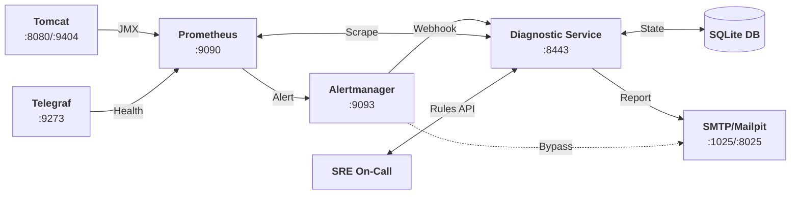
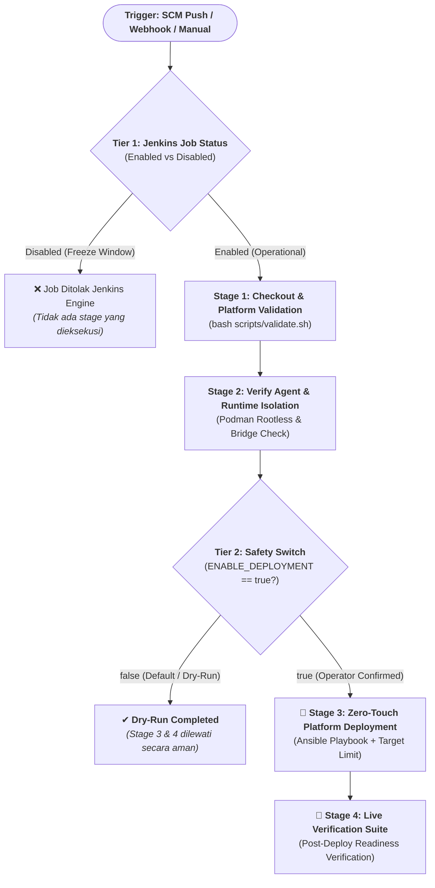

# 🚀 Tomcat Monitoring & Autonomous Diagnostic Platform

Selamat datang di repositori utama **Tomcat Monitoring**. Repositori ini berfungsi sebagai orkestrator konfigurasi, deployment otomatis, manajemen aturan diagnosis berbasis AI, serta rangkaian uji verifikasi untuk platform observabilitas dan pemulihan insiden Apache Tomcat.

Stack pemantauan ini mengintegrasikan **metrik runtime real-time (JMX & HTTP Probe)**, **perutean alert cerdas (Alertmanager)**, dan **mesin diagnosis insiden otonom (*Diagnostic Service*)** yang diperkaya basis pengetahuan SRE tanpa intervensi remedi otomatis yang berbahaya (*Zero Automatic Remediation*).

---

## 📑 Daftar Isi

- [🏛️ Arsitektur & Topologi Solusi](#-arsitektur--topologi-solusi)
- [📦 Komponen dalam Repositori (*What's in this Source*)](#-komponen-dalam-repositori-whats-in-this-source)
- [💾 Penyimpanan Persisten & Kebijakan Data (Zero `/tmp` Policy)](#-penyimpanan-persisten--kebijakan-data-zero-tmp-policy)
- [⚡ Panduan Memulai Cepat (*Quick Start — How to Use*)](#-panduan-memulai-cepat-quick-start--how-to-use)
- [🤖 Otomatisasi Fleet Provisioning & Deployment via Ansible Playbook](#-otomatisasi-fleet-provisioning--deployment-via-ansible-playbook)
  - [1. Eksekusi Menyeluruh (*One-Command Zero-Touch Deployment*)](#1-eksekusi-menyeluruh-one-command-zero-touch-deployment)
  - [2. Eksekusi Penyiapan Host Armada Saja (*Host Provisioning*)](#2-eksekusi-penyiapan-host-armada-saja-host-provisioning)
  - [3. Eksekusi Deployment Selektif ke 1 Target Saja (*Single Target Execution*)](#3-eksekusi-deployment-selektif-ke-1-target-saja-single-target-execution)
  - [4. Pola Korporat: Enterprise Multi-Dimensional Matrix Grouping (*Cross-Targeting*)](#4-pola-korporat-enterprise-multi-dimensional-matrix-grouping-cross-targeting)
  - [5. Tiga Role Modular](#5-tiga-role-modular)
  - [6. Runner Cerdas (*Dual-Execution Controller*)](#6-runner-cerdas-dual-execution-controller)
- [🏭 Integrasi Enterprise Container Registry & Image Lifecycle](#-integrasi-enterprise-container-registry--image-lifecycle)
- [📊 Katalog Metrik Observabilitas & PromQL SRE](#-katalog-metrik-observabilitas--promql-sre)
- [🛠️ Panduan Operasional SRE Sehari-hari](#-panduan-operasional-sre-sehari-hari)
- [🧪 Rangkaian Pengujian Otomatis (*Verification Suites*)](#-rangkaian-pengujian-otomatis-verification-suites)
- [🚀 Otomasi CI/CD & Pembagian 3 Lapisan Arsitektur Pipeline](#-otomasi-cicd--pembagian-3-lapisan-arsitektur-pipeline)
  - [1. Pembagian 3 Lapisan Arsitektur Pipeline](#1-pembagian-3-lapisan-arsitektur-pipeline)
  - [2. Mekanisme Pengamanan Two-Tier Defense-in-Depth](#2-mekanisme-pengamanan-two-tier-defense-in-depth)
  - [3. Panduan Operasional Deployment via Jenkins UI](#3-panduan-operasional-deployment-via-jenkins-ui)
- [📂 Struktur Repositori](#-struktur-repositori)
- [📖 Referensi & Dokumentasi Lanjutan](#-referensi--dokumentasi-lanjutan)

---

## 🏛️ Arsitektur & Topologi Solusi



---

## 📦 Komponen dalam Repositori (*What's in this Source*)

Repositori ini menyatukan seluruh artefak konfigurasi dan skrip orkestrasi untuk stack monitoring:


| Komponen | Port | Deskripsi & Peran | Konfigurasi Terkait |
| :--- | :---: | :--- | :--- |
| **`tomcat-jmx-exporter`** | `8080` (App)<br/>`9404` (TLS) | Container Tomcat target yang dipasangi Java Agent JMX Exporter untuk mengekspos metrik JVM Heap, GC STW, & Thread Pool via HTTPS. | [`config/jmx-exporter/`](config/jmx-exporter/README.md) |
| **`telegraf`** | `9273` (HTTP) | Agent lokal untuk melakukan probe liveness/readiness endpoint `/health` aplikasi secara periodik. | [`config/telegraf/`](config/telegraf/README.md) |
| **`prometheus`** | `9090` (HTTP) | Engine TSDB untuk scraping metrik (interval 30s/15s), evaluasi alert rules (`TomcatDown`, `TomcatThreadPoolSaturated`, `TomcatGCPauseHigh`), dan retensi data 15 hari. | [`config/prometheus/`](config/prometheus/README.md) |
| **`alertmanager`** | `9093` (HTTP) | Router alert yang meneruskan insiden ke Webhook HTTPS Diagnostic Service, serta jalur darurat langsung (*direct SMTP*) jika Diagnostic Service mati. | [`config/alertmanager/`](config/alertmanager/README.md) |
| **`diagnostic-service`** | `8443` (HTTPS) | Mesin diagnosis otonom 18 cabang (*TD-01..TD-18*), state machine SQLite durable, korelasi bukti log/spool, dan pengirim laporan 7-seksi SRE. | [`config/diagnostic-service/`](config/diagnostic-service/README.md) |
| **`postfix-relay`** | `587` (Internal) | Enterprise SMTP Relay Bridge (Pola A) dengan SASL Auth & STARTTLS ke downstream Mailpit/relay. | [`config/diagnostic-service/`](config/diagnostic-service/README.md) |
| **`event-collector` (`tm-agent`)** | *Daemon* | Agen background Go mandiri yang mengonsumsi stream Container Engine Socket API (`died`, `oom`, `stop`) dan mencatatnya ke spool `0700`. | Repositori [`tm-agent`](file:///home/eddywiyatno/git/tm-agent/) |
| **`tmctl`** | *CLI* | Operator CLI mandiri berbasis Go untuk orkestrasi deklaratif Socket API, audit, dan manajemen rules lintas OS. | Repositori [`tmctl`](file:///home/eddywiyatno/git/tmctl/) |
| **`mailpit`** | `8025` (UI)<br/>`1025` (SMTP) | Mock SMTP server dan Web Inbox untuk menangkap dan memverifikasi laporan investigasi SRE secara lokal. | Runtime Lab |

---

## 💾 Penyimpanan Persisten & Kebijakan Data (Zero `/tmp` Policy)

Seluruh komponen stack menggunakan **Podman Named Volumes** dan direktori terisolasi host untuk mencegah kehilangan data historis saat reboot atau container restart:

| Nama Volume / Path Persisten | Target Mount Container | Akses | Fungsi Data Persisten |
| :--- | :--- | :---: | :--- |
| **`tomcat_logs`** | `tomcat-jmx-exporter:/usr/local/tomcat/logs`<br/>`diagnostic-service:/run/tomcat-diagnostic/logs` | `rw,z`<br/>`ro,z` | Log aplikasi Tomcat (`catalina.out`, daily log) untuk korelasi bukti investigasi. |
| **`diagnostic_data`** | `diagnostic-service:/var/lib/tomcat-diagnostic` | `rw,z` | Database SQLite `diagnostic.db` (antrean insiden, custom rules, & notification log). |
| **`prometheus_data`** | `prometheus:/prometheus` | `rw,z` | Penyimpanan metrik time-series TSDB (WAL & chunk data 15 hari). |
| **`alertmanager_data`** | `alertmanager:/alertmanager` | `rw,z` | Status silences dan log notifikasi Alertmanager. |
| **`~/.local/share/tomcat-monitoring/spool`** | `diagnostic-service:/run/tomcat-diagnostic/spool` | `ro,z` | Spool event container Podman dari daemon Event Collector `tm-agent` (izin direktori ketat `0700`). |

---

## ⚡ Panduan Memulai Cepat (*Quick Start — How to Use*)

### 1. Prasyarat (*Prerequisites*)
- OS: Linux dengan Podman (mode rootless) atau Docker; Windows Server 2022/2025 dengan OpenSSH & PowerShell.
- Toolchain: `tmctl` ([`~/.local/bin/tmctl`](file:///home/eddywiyatno/git/tmctl)), `tm-agent` ([`~/.local/bin/tm-agent`](file:///home/eddywiyatno/git/tm-agent)), `python3`, `curl`, `jq`.
- Sertifikat TLS Lab sudah diinisialisasi di `~/.local/share/tomcat-monitoring/` (CA & server certs).

### 2. Metode 1: Orkestrasi Deklaratif Modern via `tmctl` CLI (Rekomendasi)

```bash
# 1. Deploy seluruh tumpukan kontainer secara otomatis (dengan readiness probing)
tmctl stack deploy --env lab

# 2. Periksa status kesehatan seluruh workload
tmctl stack status

# 3. Deploy workload spesifik
tmctl stack deploy --target diagnostic --env lab
```

### 3. Metode 2: Deployment Bertahap via Skrip Shell Legacy

```bash
# 1. Jalankan target runtime Tomcat
./scripts/deploy-tomcat.sh

# 2. Inisialisasi volume & jalankan Prometheus TSDB (Port 9090)
./scripts/deploy-prometheus.sh

# 3. Inisialisasi volume & jalankan Alertmanager (Port 9093)
./scripts/deploy-alertmanager.sh

# 4. Jalankan Diagnostic Service HTTPS Engine (Port 8443)
./scripts/deploy-diagnostic-service.sh

# 5. Pasang dan aktifkan Event Collector daemon tm-agent di host
./scripts/deploy-event-collector.sh
```

### 4. Tabel Dashboard & Endpoint Akses Cepat

| Layanan / Komponen | URL / Endpoint | Kredensial / Protokol | Keterangan |
| :--- | :--- | :--- | :--- |
| **Prometheus Web UI** | `http://localhost:9090` | HTTP / No Auth | Query PromQL, Grafik Metrik, Alert Status, TSDB Status |
| **Alertmanager Web UI** | `http://localhost:9093` | HTTP / No Auth | Monitoring Antrean Alert & Silence Rule |
| **Mailpit Web Inbox** | `http://localhost:8025` | HTTP / No Auth | Membaca Laporan Investigasi 7-Seksi SRE |
| **Diagnostic Service Health** | `https://localhost:8443/health` | HTTPS / TLS Internal | Status Liveness & Readiness Engine |
| **Diagnostic Service Metrics** | `https://localhost:8443/metrics` | HTTPS / TLS Internal | Metrik Internal Diagnostic Engine |
| **Tomcat Application** | `http://localhost:8080` | HTTP | Aplikasi Web Target & `/health` endpoint |
| **Tomcat JMX Metrics** | `https://localhost:9404/metrics` | HTTPS / TLS Client CA | Raw Prometheus Metrics dari JMX Exporter |

---

## 🤖 Otomatisasi Fleet Provisioning & Deployment via Ansible Playbook

Sesuai keputusan arsitektur [TM-ADR-0025](file:///home/eddywiyatno/git/devops-handbook/docs/adr/tomcat-monitoring/adr-records/TM-ADR-0025.md), [TM-ADR-0026](file:///home/eddywiyatno/git/devops-handbook/docs/adr/tomcat-monitoring/adr-records/TM-ADR-0026.md), [TM-ADR-0027](file:///home/eddywiyatno/git/devops-handbook/docs/adr/tomcat-monitoring/adr-records/TM-ADR-0027.md), dan [TM-ADR-0028](file:///home/eddywiyatno/git/devops-handbook/docs/adr/tomcat-monitoring/adr-records/TM-ADR-0028.md), repositori ini menyediakan otomasi penyediaan armada (*fleet provisioning*) dan deployment tumpukan monitoring secara idempoten berbasis **Ansible Playbooks & Thin Declarative Roles** berbasis `tmctl` dan `tm-agent` dengan *Multi-OS Fact Branching* (Linux & Windows).

> 📖 **Panduan Lengkap Desain Inventori & Targeting Cheatsheet:**
> Dokumentasi lengkap tata kelola inventori, katalog berkas, dan cheatsheet logika Boolean Ansible (`&`, `:`, `!`) tersedia di berkas [`inventories/README.md`](inventories/README.md).

### 1. Eksekusi Menyeluruh (*One-Command Zero-Touch Deployment*)
Eksekusi ini secara otomatis menyiapkan direktori aman (`0700` Linux / `C:\monitoring` Windows), token rahasia, sertifikat TLS, bridge network, named volumes, daemon event collector (`tm-agent` / `tm-agent.exe`), mendelegasikan deployment kontainer stack ke biner `tmctl`, dan memverifikasi kesehatan seluruh endpoint (*readiness probes*):

```bash
# Menjalankan di lingkungan Lab Lokal
bash scripts/run-ansible-playbook.sh deploy-stack.yml -i inventories/lab.ini

# Menjalankan di lingkungan AWS Staging (Multi-OS: Linux + Windows)
bash scripts/run-ansible-playbook.sh deploy-stack.yml -i inventories/aws-staging.ini

# Menjalankan di lingkungan AWS Production (Multi-OS Fleet)
bash scripts/run-ansible-playbook.sh deploy-stack.yml -i inventories/aws-production.ini
```

### 2. Eksekusi Penyiapan Host Armada Saja (*Host Provisioning*)
Untuk menyiapkan node target baru (folder persisten, material rahasia, TLS, bridge network, named volumes, biner operator `tmctl`, dan event collector daemon `tm-agent`) tanpa menyalakan kontainer monitoring:

```bash
bash scripts/run-ansible-playbook.sh provision-fleet.yml -i inventories/aws-staging.ini
```

### 3. Eksekusi Deployment Selektif ke 1 Target Saja (*Single Target Execution*)
Ketika armada terdiri dari puluhan server (misalnya 10 node Tomcat) dan Anda hanya ingin mengeksekusi deployment atau update ke **1 server tertentu saja** (atau subset grup tertentu), gunakan parameter `--limit` (alias `-l`):

```bash
# Skenario 1: Eksekusi HANYA ke 1 host Windows spesifik (berdasarkan nama host inventori)
bash scripts/run-ansible-playbook.sh deploy-stack.yml -i inventories/aws-staging.ini --limit aws-ec2-win-01

# Skenario 2: Eksekusi HANYA ke 1 host Linux spesifik berdasarkan IP address
bash scripts/run-ansible-playbook.sh deploy-stack.yml -i inventories/aws-staging.ini --limit 98.81.129.144

# Skenario 3: Eksekusi HANYA ke seluruh armada Windows (group targeting)
bash scripts/run-ansible-playbook.sh deploy-stack.yml -i inventories/aws-staging.ini --limit windows_nodes

# Skenario 4: Eksekusi HANYA ke armada Linux (group targeting)
bash scripts/run-ansible-playbook.sh deploy-stack.yml -i inventories/aws-staging.ini --limit linux_nodes

# Skenario 5: Eksekusi ke subset grup Tomcat Fleet
bash scripts/run-ansible-playbook.sh deploy-stack.yml -i inventories/aws-staging.ini --limit tomcat_fleet
```

> [!TIP]
> Parameter `--limit` memastikan Ansible melewati (*skip*) node lain yang tidak cocok dengan pola limit, sehingga proses deployment berlangsung sangat cepat, hemat bandwidth, dan aman dari resiko regresi pada server lain yang sedang melayani traffic produksi.

### 4. Pola Korporat: Enterprise Multi-Dimensional Matrix Grouping (*Cross-Targeting*)
Untuk lingkungan perusahaan/datacenter on-premise yang memiliki banyak aplikasi (`app_core`, `app_payment`, dll) dan multi-environment (`dev`, `sit`, `uat`, `siteprodA`, `siteprodB`), gunakan templat inventori matriks multi-dimensi [`inventories/enterprise-matrix.ini.example`](inventories/enterprise-matrix.ini.example).

Pola ini memungkinkan penargetan cross-matrix menggunakan operator logika Boolean Ansible:

```bash
# 1. Irisan (AND / &): Deploy HANYA ke aplikasi payment di environment UAT
bash scripts/run-ansible-playbook.sh deploy-stack.yml -i inventories/enterprise-matrix.ini.example --limit "app_payment:&env_uat"

# 2. Irisan (AND / &): Deploy HANYA ke aplikasi core di Site Prod A
bash scripts/run-ansible-playbook.sh deploy-stack.yml -i inventories/enterprise-matrix.ini.example --limit "app_core:&env_siteprodA"

# 3. Irisan (AND / &): Deploy HANYA ke semua server Windows di Production (Prod A & Prod B)
bash scripts/run-ansible-playbook.sh deploy-stack.yml -i inventories/enterprise-matrix.ini.example --limit "windows_nodes:&env_production"

# 4. Gabungan (OR / :): Deploy ke environment DEV dan SIT sekaligus
bash scripts/run-ansible-playbook.sh deploy-stack.yml -i inventories/enterprise-matrix.ini.example --limit "env_dev:env_sit"

# 5. Negasi (NOT / !): Deploy ke semua server Production KECUALI Site Prod B
bash scripts/run-ansible-playbook.sh deploy-stack.yml -i inventories/enterprise-matrix.ini.example --limit "env_production:!env_siteprodB"
```
*Rincian panduan & diagram alur lengkap:* [`inventories/README.md`](inventories/README.md).

### 5. Tiga Role Modular ([`roles/`](roles/README.md))
- **`role_host_prep`:** Inisialisasi folder aman (`spool`, `secrets`, `tls`), material rahasia `0400`, sertifikat TLS `server.crt`/`server.key`, *network bridge* `devops-lab`, dan named volumes. Menyediakan biner `tmctl` (Linux) atau `tmctl.exe` (Windows).
- **`role_event_collector`:** Multi-OS Fact Branching untuk instalasi daemon `tm-agent` / `tm-agent.exe`, direktori spool `0700`, unit service Linux `systemd --user` (`tm-agent.service.j2`), dan background daemon Windows.
- **`role_container_stack`:** *Thin declarative orchestrator* yang mendelegasikan rekonsiliasi kontainer monitoring (Mailpit, Postfix Relay, Tomcat JMX, Prometheus, Alertmanager, Diagnostic Service) ke biner operator `tmctl stack deploy`. Diabaikan secara aman pada host Windows murni (*host-prep only*).

### 6. Runner Cerdas (*Dual-Execution Controller*)
Skrip `scripts/run-ansible-playbook.sh` secara cerdas mendeteksi lingkungan:
- Jika ada biner `ansible-playbook` di host $\rightarrow$ langsung dieksekusi.
- Jika tidak ada Ansible di host $\rightarrow$ otomatis dieksekusi di dalam kontainer terisolasi `localhost/ansible-controller:1.0` dengan `--network host` dan socket Podman mount.

---

## 🏭 Integrasi Enterprise Container Registry & Image Lifecycle

Platform Tomcat Monitoring mengimplementasikan integrasi *Plug-and-Play Enterprise Container Registry* ([TASK-TM-025](file:///home/eddywiyatno/git/devops-handbook/docs/projects/tomcat-monitoring/follow-up-tasks.md#task-tm-025-tn-010-implement-plug-and-play-enterprise-container-registry-integration-and-image-lifecycle-configuration) / [TN-010](file:///home/eddywiyatno/git/devops-handbook/docs/projects/tomcat-monitoring/engineering-journal/continuous-integration-and-deployment/TN-010-implement-plug-and-play-container-registry-integration.md)) dengan prinsip **Zero Logic Modification**.

### 1. Model Konfigurasi Deklaratif (SSOT)
Transisi dari lingkungan Lab lokal (`localhost`) ke registry korporat (Harbor, Nexus, Quay, GitLab/Gitea) dilakukan murni melalui konfigurasi deklaratif:

- **Konfigurasi Lokal/Bash:** Berkas [`CONFIG`](CONFIG) dan templat enterprise [`CONFIG.example`](CONFIG.example).
- **Konfigurasi Ansible Fleet:** [`inventories/group_vars/all.yml`](inventories/group_vars/all.yml) dan templat production [`inventories/production.ini.example`](inventories/production.ini.example).

### 2. Parameter Utama Registry
| Parameter | Default (Lab) | Contoh Enterprise | Deskripsi |
| :--- | :--- | :--- | :--- |
| `REGISTRY_URL` / `registry_host` | `localhost` | `harbor.corp.internal:5000` | Host FQDN atau IP registry |
| `REGISTRY_NAMESPACE` / `registry_namespace` | `""` *(empty)* | `tomcat-platform` | Project namespace / organization |
| `REGISTRY_TLS_VERIFY` / `registry_tls_verify` | `false` | `true` | Verifikasi sertifikat TLS registry |
| `IMAGE_PULL_POLICY` / `image_pull_policy` | `IfNotPresent` | `Always` / `IfNotPresent` | Kebijakan penarikan image (`Always`, `IfNotPresent`, `Never`) |
| `REGISTRY_AUTH_FILE` / `registry_auth_file` | `""` | `~/.config/containers/auth.json` | Path berkas kredensial Podman auth terisolasi |

### 3. Otomasi Autentikasi Terisolasi
Repositori menyediakan skrip helper [`scripts/registry-login-helper.sh`](scripts/registry-login-helper.sh) untuk autentikasi aman tanpa mencemari global daemon store:
```bash
# Login interaktif ke registry enterprise
./scripts/registry-login-helper.sh login harbor.corp.internal:5000 myuser

# Login menggunakan auth file terisolasi
./scripts/registry-login-helper.sh login harbor.corp.internal:5000 myuser /path/to/token.txt ~/.config/containers/auth.json
```

> 📖 **Panduan Migrasi Lengkap:**
> SOP migrasi image dari lab ke registry enterprise tersedia di [`enterprise-container-registry-migration-guide.md`](file:///home/eddywiyatno/git/devops-handbook/docs/projects/tomcat-monitoring/operations/enterprise-container-registry-migration-guide.md).

---

## 📊 Katalog Metrik Observabilitas & PromQL SRE

Prometheus secara otomatis mengumpulkan metrik dari target berikut:

### 1. Metrik JVM & Tomcat (`tomcat-jmx-exporter` :9404)
- **Heap Memory Used:** `jvm_memory_bytes_used{area="heap"} / (1024*1024)` *(MB)*
- **Heap Usage Ratio (%):** `(jvm_memory_bytes_used{area="heap"} / jvm_memory_bytes_max{area="heap"}) * 100`
- **Old Gen Memory Pool (%):** `(jvm_memory_pool_used_bytes{pool=~".*Old.*"} / jvm_memory_pool_max_bytes{pool=~".*Old.*"}) * 100`
- **GC CPU Overhead (%):** `(rate(jvm_gc_pause_seconds_sum[5m]) * 100)`
- **GC STW Max Latency:** `jvm_gc_pause_seconds_max` *(Detik)*
- **Tomcat Thread Pool Saturation (%):** `(tomcat_threads_busy_threads / tomcat_threads_current_threads) * 100`

### 2. Metrik Diagnostic Engine (`tomcat-diagnostic-service` :8443)
- **Status Kesiapan Engine:** `diagnostic_service_ready` (`1`=Ready, `0`=Down)
- **Ukuran Database SQLite (KB):** `diagnostic_db_size_bytes / 1024`
- **Task Macet Dipulihkan (*Stale Locks*):** `diagnostic_stale_locks_recovered_total`
- **Laju Ingestion Webhook:** `rate(diagnostic_events_ingested_total[5m])`

> 📖 **Katalog Lengkap & PromQL Cheatsheet:**
> Rincian seluruh metrik dan formula kueri troubleshooting tersedia di [`devops-handbook/docs/projects/tomcat-monitoring/references/prometheus-metrics-catalog.md`](file:///home/eddywiyatno/git/devops-handbook/docs/projects/tomcat-monitoring/references/prometheus-metrics-catalog.md).

---

## 🛠️ Panduan Operasional SRE Sehari-hari

### A. Mengubah Retensi & Konfigurasi Prometheus
Untuk menyesuaikan masa simpan data metrik atau menambah batas kapasitas TSDB di disk:

```bash
# Mengubah retensi menjadi 30 hari (tanpa menghapus data yang ada)
PROMETHEUS_RETENTION_TIME="30d" ./scripts/deploy-prometheus.sh

# Mengubah retensi menjadi 7 hari dengan batas kuota disk 5 GB
PROMETHEUS_RETENTION_TIME="7d" PROMETHEUS_RETENTION_SIZE="5GB" ./scripts/deploy-prometheus.sh

# Menerapkan perubahan prometheus.yml / alert rules tanpa restart (Zero Downtime)
./scripts/initialize-prometheus-volumes.sh ~/.local/share/tomcat-monitoring/jmx-exporter-tls/server.crt
curl -X POST http://127.0.0.1:9090/-/reload
```

*Panduan lengkap SOP operasional:* [`config/prometheus/README.md`](config/prometheus/README.md#panduan-operasional-sre-how-to-configuration--operations-sop).

---

### B. Mengelola Aturan Diagnostik AI (*Dynamic Rule Management*)
SRE dapat memasukkan aturan diagnosis baru hasil sintesis post-mortem atau mengekspor aturan aktif:

```bash
# 1. Ingest curated rulepack ke database SQLite (Hot-Ingest)
BEARER_TOKEN="test-token-12345" ./scripts/ingest-rule.sh config/rules/curated-production-rulepacks.json

# 2. Ingest single rule JSON kustom
BEARER_TOKEN="test-token-12345" ./scripts/ingest-rule.sh /path/to/custom-rule.json

# 3. Ekspor master catalog aturan aktif
./scripts/export-rules.sh > ~/master-rules.json

# 4. Ekspor aturan berdasarkan kategori domain (misal: database_persistence)
./scripts/export-rules.sh --category database_persistence
```

---

### C. Pengelolaan Daemon Restricted Event Collector & Spool Lifecycle
Restricted Event Collector berjalan sebagai background daemon `systemd --user` (Linux) atau background Windows service (`tm-agent.exe`), menangkap container event (`died`, `oom`, `exit code`) dan mencatatnya ke spool persisten:

```bash
# 1. Deployment / update daemon unit service
./scripts/deploy-event-collector.sh

# 2. Cek status aktif daemon (Linux)
systemctl --user status tm-agent.service

# 3. Cek live audit log daemon (Linux)
journalctl --user -u tm-agent.service -f

# 4. Audit direktori spool & izin akses (wajib mode 0700)
ls -ld ~/.local/share/tomcat-monitoring/spool
ls -la ~/.local/share/tomcat-monitoring/spool | head -n 10
```

*Pada Windows Target Host (PowerShell):*
```powershell
# 1. Periksa proses background daemon tm-agent
Get-Process tm-agent

# 2. Periksa berkas event spool JSON
Get-ChildItem C:\monitoring\spool\
Get-Content (Get-ChildItem C:\monitoring\spool\*.json | Select-Object -Last 1).FullName
```

---

### D. Pengelolaan Volume Persisten & Log Runtime Tomcat
Log aplikasi Tomcat disimpan persisten pada Podman Named Volume `tomcat_logs` (`/usr/local/tomcat/logs:z`), dibaca secara *read-only* oleh Diagnostic Service untuk korelasi bukti investigasi:

```bash
# 1. Memeriksa keberadaan named volume
podman volume ls | grep tomcat_logs

# 2. Memeriksa isi log runtime Tomcat langsung dari volume
podman run --rm -v tomcat_logs:/logs:ro alpine ls -lh /logs

# 3. Memantau tail log catalina.out secara real-time
podman logs -f tomcat-jmx-exporter

# 4. Membaca cuplikan log catalina dari sudut pandang Diagnostic Service
podman exec -it diagnostic-service ls -la /run/tomcat-diagnostic/logs
```

---

## 🧪 Rangkaian Pengujian Otomatis (*Verification Suites*)

Repository ini menyediakan serangkaian skrip pengujian live dan static analysis:

```bash
# 1. Validasi Baseline Governance & File Layout Statis
./scripts/validate.sh

# 2. Simulasi Insiden Live TomcatDown (Firing -> Diagnosis -> Resolution)
./scripts/test-tomcatdown-live.sh

# 3. Pengujian Postfix Enterprise SMTP Relay & Header RFC Kepatuhan
./scripts/verify-postfix-relay.sh

# 4. Pengujian Beban Kerja JVM GC & Concurrency Saturation Live
./scripts/verify-jvm-workload-live.sh

# 5. Pengujian Siklus Hidup AI Knowledge & 5-Layer Ingestion Defense
./scripts/validate-ai-knowledge-lifecycle.sh
```

---

## 🚀 Otomasi CI/CD & Pembagian 3 Lapisan Arsitektur Pipeline

### 1. Pembagian 3 Lapisan Arsitektur Pipeline
Platform Tomcat Monitoring mengadopsi pola **Decoupled Component CI + Orchestrated Stack CD Hub** ([TM-ADR-0024](file:///home/eddywiyatno/git/devops-handbook/docs/adr/tomcat-monitoring/adr-records/TM-ADR-0024.md)) yang memisahkan alur otomasi ke dalam **3 Lapisan Arsitektur**:

| Lapisan Arsitektur (*Layer*) | Repositori & Pipeline Jenkins | Peran & Ruang Lingkup |
| :--- | :--- | :--- |
| **Application Layer** | **Pipeline 1**<br/>[`tomcat-diagnostic-service`](file:///home/eddywiyatno/git/tomcat-diagnostic-service) | **Backend Mikroservis / Kode Aplikasi**<br/>Menguji kode aplikasi Node.js 24, validasi 62 *unit/schema test suites*, membangun OCI container image (`ef71e6e2b7d0`), dan *ephemeral smoke test*. |
| **Host Daemon Layer** | **Pipeline 2**<br/>[`tm-agent`](file:///home/eddywiyatno/git/tm-agent) | **Host Daemon / Agen Pengamat Sistem Operasi**<br/>Menguji biner Go pengamat container event di host, pengujian cross-platform Linux & Windows, serta validasi spool `0700`. |
| **Infrastructure Layer** | **Pipeline 3**<br/>[`tomcat-monitoring`](file:///home/eddywiyatno/git/tomcat-monitoring) | **Infrastruktur Platform & Orkestrasi Multi-Kontainer (*Infrastructure as Code*)**<br/>Mengelola *network bridge* (`devops-lab`), *named volumes*, layanan COTS (Prometheus, Alertmanager, Postfix SMTP Relay, Mailpit), *zero-touch deployment*, serta *Live Verification Suite*. |

---

### 2. Mekanisme Pengamanan Two-Tier Defense-in-Depth

Untuk mencegah terjadinya *accidental execution* atau gangguan pada server produksi saat build otomatis terpantik (misalnya via Webhook SCM, Pull Request sync, atau refresh konfigurasi parameter Jenkinsfile), pipeline CD mengimplementasikan pengamanan **Two-Tier Defense-in-Depth**:



#### Komponen Pengamanan:
1. **Tier 1 — Job Level Enable/Disable di Jenkins UI:**
   - **Fungsi:** Menghentikan seluruh proses CI/CD di tingkat antrean Jenkins.
   - **Penggunaan:** Ketika sedang dalam periode *change freeze*, *maintenance window* eksternal, atau perbaikan infrastruktur host agent.
   - **Cara:** Klik tombol **"Disable Project"** pada halaman utama job Jenkins `tomcat-monitoring-pipeline`.
2. **Tier 2 — Pipeline Parameter Safety Switch (`ENABLE_DEPLOYMENT`):**
   - **Fungsi:** Mencegah eksekusi deployment langsung ke server target ketika pipeline dijalankan secara otomatis atau saat me-refresh definisi parameter. Default diset ke `false` (*Dry-Run Safe Mode*).
   - **Hasil saat `ENABLE_DEPLOYMENT = false`:** Pipeline mengeksekusi **Stage 1 (Checkout & Validation)** dan **Stage 2 (Runtime Isolation Verification)**, lalu melewati (*skip*) **Stage 3 (Deployment)** dan **Stage 4 (Live Tests)**.

---

### 3. Panduan Operasional Deployment via Jenkins UI

Berikut adalah tata cara bagi Operator/SRE untuk mengeksekusi deployment melalui antarmuka web Jenkins:

#### Langkah 1: Membuka Menu Build with Parameters
1. Buka antarmuka Jenkins: `http://localhost:8080` (atau Jenkins korporat Anda).
2. Masuk ke job: **`tomcat-monitoring-pipeline`**.
3. Klik menu **"Build with Parameters"** di panel navigasi sebelah kiri.

> [!NOTE]
> Jika tombol **"Build with Parameters"** belum muncul (hanya tombol *"Build Now"*), klik *"Build Now"* 1 kali untuk melakukan refresh skema parameter dari Jenkinsfile ke Jenkins DB. Karena `ENABLE_DEPLOYMENT` default-nya bernilai `false`, eksekusi pertama ini 100% aman (hanya melakukan dry-run validasi konfigurasi).

#### Langkah 2: Mengatur Parameter Eksekusi
Sesuaikan nilai formulir parameter sesuai kebutuhan:

| Nama Parameter | Nilai Default | Pilihan / Format | Penjelasan Operasional |
| :--- | :--- | :--- | :--- |
| **`DEPLOY_ENV`** | `aws-staging` | `aws-staging`, `aws-production`, `production`, `staging`, `lab` | Menentukan berkas inventori target (`inventories/<DEPLOY_ENV>.ini`). |
| **`TARGET_HOST`** | `all` | `all`, `aws-ec2-win-01`, `windows_nodes`, `linux_nodes`, `54.242.205.212` | **Penyaring Target Host / Grup.** Isi dengan nama host tunggal atau grup jika hanya ingin deploy ke 1 server saja. |
| **`ENABLE_DEPLOYMENT`** | `false` *(unchecked)* | Checkbox (`true` / `false`) | **Safety Switch.** Wajib **dicentang** jika ingin mengeksekusi deployment nyata ke server target. |
| **`REGISTRY_HOST`** | `localhost` | FQDN / IP Registry | Registry penampung OCI image. |
| **`EXECUTE_LIVE_TESTS`** | `true` *(checked)* | Checkbox (`true` / `false`) | Menjalankan suite verifikasi kesehatan pasca-deploy. |

#### Langkah 3: Eksekusi Deployment ke 1 Host Tertentu
Contoh konfigurasi form untuk mendeploy **HANYA ke 1 target node Windows** di AWS Staging:
- **`DEPLOY_ENV`**: `aws-staging`
- **`TARGET_HOST`**: `aws-ec2-win-01` *(atau `windows_nodes`)*
- **`ENABLE_DEPLOYMENT`**: ☑ *(Centang / `true`)*
- **`EXECUTE_LIVE_TESTS`**: ☑ *(Centang)*
- Klik tombol **"Build"**.

---

## 📂 Struktur Repositori

```text
tomcat-monitoring/
├── CONFIG                       Declarative SSOT metadata & platform baseline (network, ports, volumes, thresholds)
├── CONFIG.example               Enterprise container registry configuration template
├── Jenkinsfile                  Declarative Jenkins CI/CD pipeline with parameterized targeting & safety switches
├── ansible.cfg                  Ansible configuration with local/remote temp isolation (~/.ansible/tmp)
├── deploy-stack.yml             Master Ansible playbook: end-to-end stack provisioning & deployment
├── provision-fleet.yml          Ansible playbook: standalone host provisioning & event collector daemon
├── inventories/                 Hierarchical Multi-OS Ansible inventory directory (README.md):
│   ├── group_vars/all.yml       Global configuration defaults, registry parameters, & engine selectors
│   ├── lab.ini                  Single-node localhost lab inventory (Public / Safe)
│   ├── enterprise-matrix.ini.example Multi-Dimensional matrix inventory template (App x Env x OS)
│   ├── aws-staging.ini.example  AWS Cloud Staging Multi-OS inventory template
│   ├── aws-production.ini.example AWS Cloud Production Multi-OS fleet template
│   ├── staging.ini.example      Pre-production staging cluster inventory template
│   └── production.ini.example   Enterprise registry production inventory template
├── roles/                       Modular Ansible roles with Multi-OS fact branching (README.md):
│   ├── role_host_prep/          Directories (0700/C:\monitoring), secrets/TLS, network, & binaries
│   ├── role_event_collector/    Multi-OS tm-agent daemon unit deployment & lifecycle
│   └── role_container_stack/    Desired state container orchestration via tmctl (Linux nodes)
│       └── tasks/pull_images.yml Podman image pull reconciliation task
├── config/                      Konfigurasi statis non-secret:
│   ├── alertmanager/            Routing rules, webhook route, & direct SMTP (README.md)
│   ├── diagnostic-service/      Application config, targets allowlist, & SMTP relay (README.md)
│   ├── jmx-exporter/            Spesifikasi pola MBean & metrik JVM (README.md)
│   ├── prometheus/              Scrape targets, TSDB retention, & alert rules (README.md)
│   ├── rules/                   Curated master rulepacks (curated-production-rulepacks.json)
│   └── telegraf/                Konfigurasi probe HTTP health (README.md)
├── fixtures/                    Mock components & test fixtures:
│   ├── alertmanager-webhook-receiver/  Webhook capture fixture
│   ├── diagnostic-service-mailpit/     Mock assertions HTTPS/Mailpit/SQLite
│   └── tomcat-health-app/              Exploded JSP health application
├── scripts/                     Automasi deployment, CLI operasional, & test suites:
│   ├── container-runtime-helper.sh      Adaptive multi-engine runtime helper (Podman/Docker)
│   ├── registry-login-helper.sh         Isolated enterprise container registry auth helper
│   ├── run-ansible-playbook.sh          Dual-execution Ansible runner (Host / Container controller)
│   ├── validate-ansible.sh              Ansible layout & syntax validation suite
│   ├── deploy-alertmanager.sh           Deploy container Alertmanager
│   ├── deploy-diagnostic-service.sh     Deploy container Diagnostic Service
│   ├── deploy-event-collector.sh        Deploy Restricted Event Collector daemon
│   ├── deploy-prometheus.sh             Deploy container Prometheus TSDB
│   ├── deploy-tomcat.sh                 Deploy container Tomcat JMX Exporter
│   ├── export-rules.sh                  CLI ekspor master catalog aturan aktif
│   ├── ingest-rule.sh                   CLI ingest dynamic rulepack
│   ├── test-tomcatdown-live.sh          End-to-end incident verification
│   ├── verify-postfix-relay.sh          Enterprise SMTP relay verification
│   ├── verify-jvm-workload-live.sh      Live JVM workload simulation suite
│   ├── validate-ai-knowledge-lifecycle.sh AI knowledge lifecycle test suite
│   └── validate.sh                      Static layout & contract validator
└── validation/                  Skrip validator statis per komponen
```

---

## 📖 Referensi & Dokumentasi Lanjutan

* 📚 **DevOps Handbook Utama:** [`devops-handbook/`](file:///home/eddywiyatno/git/devops-handbook/)
* 📓 **TN-018 AWS Windows Fleet Deployment & Verification:** [`TN-018-aws-windows-fleet-deployment-cross-platform-ansible-provisioning-and-live-verification.md`](file:///home/eddywiyatno/git/devops-handbook/docs/projects/tomcat-monitoring/engineering-journal/continuous-integration-and-deployment/TN-018-aws-windows-fleet-deployment-cross-platform-ansible-provisioning-and-live-verification.md)
* 📓 **TN-017 Multi-Cloud AWS Fleet Staging Environment Provisioning:** [`TN-017-multi-cloud-aws-fleet-staging-environment-provisioning.md`](file:///home/eddywiyatno/git/devops-handbook/docs/projects/tomcat-monitoring/engineering-journal/continuous-integration-and-deployment/TN-017-multi-cloud-aws-fleet-staging-environment-provisioning.md)
* 📓 **TN-014 Refactor Ansible Roles & OS Fact Branching:** [`TN-014-refactor-ansible-roles-into-thin-orchestrator-based-on-tmctl-and-os-fact-branching.md`](file:///home/eddywiyatno/git/devops-handbook/docs/projects/tomcat-monitoring/engineering-journal/continuous-integration-and-deployment/TN-014-refactor-ansible-roles-into-thin-orchestrator-based-on-tmctl-and-os-fact-branching.md)
* 🏭 **Enterprise Container Registry Migration Guide:** [`enterprise-container-registry-migration-guide.md`](file:///home/eddywiyatno/git/devops-handbook/docs/projects/tomcat-monitoring/operations/enterprise-container-registry-migration-guide.md)
* 📡 **REST API Reference Matrix:** [`diagnostic-service-rest-api-reference.md`](file:///home/eddywiyatno/git/devops-handbook/docs/projects/tomcat-monitoring/references/diagnostic-service-rest-api-reference.md)
* 📊 **Prometheus Metrics Catalog & SRE Cheatsheet:** [`prometheus-metrics-catalog.md`](file:///home/eddywiyatno/git/devops-handbook/docs/projects/tomcat-monitoring/references/prometheus-metrics-catalog.md)
* 📘 **SRE Operations Runbook:** [`ai-knowledge-enrichment-and-rule-management-runbook.md`](file:///home/eddywiyatno/git/devops-handbook/docs/projects/tomcat-monitoring/operations/ai-knowledge-enrichment-and-rule-management-runbook.md)
* 🏛️ **Architecture Decision Records (ADRs):** [`docs/adr/tomcat-monitoring/`](file:///home/eddywiyatno/git/devops-handbook/docs/adr/tomcat-monitoring/)
* 📓 **Engineering Journals & Technical Notes:** [`docs/projects/tomcat-monitoring/engineering-journal/`](file:///home/eddywiyatno/git/devops-handbook/docs/projects/tomcat-monitoring/engineering-journal/)
