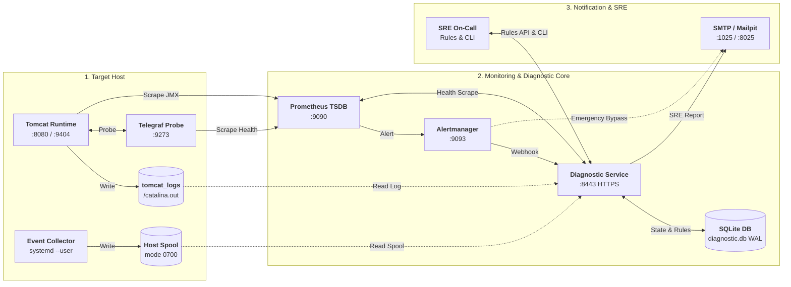

# 🚀 Tomcat Monitoring & Autonomous Diagnostic Platform

Selamat datang di repositori utama **Tomcat Monitoring**. Repositori ini berfungsi sebagai orkestrator konfigurasi, deployment otomatis, manajemen aturan diagnosis berbasis AI, serta rangkaian uji verifikasi untuk platform observabilitas dan pemulihan insiden Apache Tomcat.

Stack pemantauan ini mengintegrasikan **metrik runtime real-time (JMX & HTTP Probe)**, **perutean alert cerdas (Alertmanager)**, dan **mesin diagnosis insiden otonom (*Diagnostic Service*)** yang diperkaya basis pengetahuan SRE tanpa intervensi remedi otomatis yang berbahaya (*Zero Automatic Remediation*).

---

## 📑 Daftar Isi

- [🏛️ Arsitektur & Topologi Solusi](#-arsitektur--topologi-solusi)
- [📦 Komponen dalam Repositori (*What's in this Source*)](#-komponen-dalam-repositori-whats-in-this-source)
- [💾 Penyimpanan Persisten & Kebijakan Data (Zero `/tmp` Policy)](#-penyimpanan-persisten--kebijakan-data-zero-tmp-policy)
- [⚡ Panduan Memulai Cepat (*Quick Start — How to Use*)](#-panduan-memulai-cepat-quick-start--how-to-use)
- [📊 Katalog Metrik Observabilitas & PromQL SRE](#-katalog-metrik-observabilitas--promql-sre)
- [🛠️ Panduan Operasional SRE Sehari-hari](#-panduan-operasional-sre-sehari-hari)
- [🧪 Rangkaian Pengujian Otomatis (*Verification Suites*)](#-rangkaian-pengujian-otomatis-verification-suites)
- [📂 Struktur Repositori](#-struktur-repositori)
- [📖 Referensi & Dokumentasi Lanjutan](#-referensi--dokumentasi-lanjutan)

---

## 🏛️ Arsitektur & Topologi Solusi



---

## 📦 Komponen dalam Repositori (*What's in this Source*)

Repositori ini menyatukan seluruh artefak konfigurasi dan skrip orkestrasi untuk stack monitoring:


| Komponen | Port | Deskripsi & Peran | Konfigurasi Terkait |
| :--- | :---: | :--- | :--- |
| **`tomcat-jmx-exporter`** | `8080` (App)<br/>`9404` (TLS) | Container Tomcat target yang dipasangi Java Agent JMX Exporter untuk mengekspos metrik JVM Heap, GC STW, & Thread Pool via HTTPS. | [`config/jmx-exporter/`](config/jmx-exporter/README.md) |
| **`telegraf`** | `9273` (HTTP) | Agent lokal untuk melakukan probe liveness/readiness endpoint `/health` aplikasi secara periodik. | [`config/telegraf/`](config/telegraf/README.md) |
| **`prometheus`** | `9090` (HTTP) | Engine TSDB untuk scraping metrik (interval 30s/15s), evaluasi alert rules (`TomcatDown`, `TomcatThreadPoolSaturated`, `TomcatGCPauseHigh`), dan retensi data 15 hari. | [`config/prometheus/`](config/prometheus/README.md) |
| **`alertmanager`** | `9093` (HTTP) | Router alert yang meneruskan insiden ke Webhook HTTPS Diagnostic Service, serta jalur darurat langsung (*direct SMTP*) jika Diagnostic Service mati. | [`config/alertmanager/`](config/alertmanager/README.md) |
| **`diagnostic-service`** | `8443` (HTTPS) | Mesin diagnosis otonom 18 cabang (*TD-01..TD-18*), state machine SQLite durable, korelasi bukti log/spool, dan pengirim laporan 7-seksi SRE. | [`config/diagnostic-service/`](config/diagnostic-service/README.md) |
| **`event-collector`** | *Daemon* | Service `systemd --user` di host yang mengamati event container Podman (`died`, `oom`, `exit code`) dan mencatatnya ke direktori spool berizin `0700`. | Repositori [`event-collector`](file:///home/eddywiyatno/git/tomcat-diagnostic-event-collector/) |
| **`mailpit`** | `8025` (UI)<br/>`1025` (SMTP) | Mock SMTP server dan Web Inbox untuk menangkap dan memverifikasi laporan investigasi SRE secara lokal. | Runtime Lab |

---

## 💾 Penyimpanan Persisten & Kebijakan Data (Zero `/tmp` Policy)

Seluruh komponen stack menggunakan **Podman Named Volumes** dan direktori terisolasi host untuk mencegah kehilangan data historis saat reboot atau container restart:

| Nama Volume / Path Persisten | Target Mount Container | Akses | Fungsi Data Persisten |
| :--- | :--- | :---: | :--- |
| **`tomcat_logs`** | `tomcat-jmx-exporter:/usr/local/tomcat/logs`<br/>`diagnostic-service:/run/tomcat-diagnostic/logs` | `rw,z`<br/>`ro,z` | Log aplikasi Tomcat (`catalina.out`, daily log) untuk korelasi bukti investigasi. |
| **`diagnostic_data`** | `diagnostic-service:/var/lib/tomcat-diagnostic` | `rw,z` | Database SQLite `diagnostic.db` (antrean insiden, custom rules, & notification log). |
| **`prometheus_data`** | `prometheus:/prometheus` | `rw,z` | Penyimpanan metrik time-series TSDB (WAL & chunk data 15 hari). |
| **`alertmanager_data`** | `alertmanager:/alertmanager` | `rw,z` | Status silences dan log notifikasi Alertmanager. |
| **`~/.local/share/tomcat-monitoring/spool`** | `diagnostic-service:/run/tomcat-diagnostic/spool` | `ro,z` | Spool event container Podman dari daemon Event Collector (izin direktori ketat `0700`). |

---

## ⚡ Panduan Memulai Cepat (*Quick Start — How to Use*)

### 1. Prasyarat (*Prerequisites*)
- OS: Linux dengan Podman (mode rootless).
- Toolchain: `bash`, `python3`, `curl`, `jq`, `promtool` (opsional).
- Sertifikat TLS Lab sudah digenerate di `~/.local/share/tomcat-monitoring/` (CA & server certs).

### 2. Langkah Deployment Bertahap (*Zero-to-Hero*)

```bash
# 1. Jalankan target runtime Tomcat
./scripts/deploy-tomcat.sh

# 2. Inisialisasi volume & jalankan Prometheus TSDB (Port 9090)
./scripts/deploy-prometheus.sh

# 3. Inisialisasi volume & jalankan Alertmanager (Port 9093)
./scripts/deploy-alertmanager.sh

# 4. Jalankan Diagnostic Service HTTPS Engine (Port 8443)
./scripts/deploy-diagnostic-service.sh

# 5. Pasang dan aktifkan Restricted Event Collector daemon di host
./scripts/deploy-event-collector.sh
```

### 3. Tabel Dashboard & Endpoint Akses Cepat

| Layanan / Komponen | URL / Endpoint | Kredensial / Protokol | Keterangan |
| :--- | :--- | :--- | :--- |
| **Prometheus Web UI** | `http://localhost:9090` | HTTP / No Auth | Query PromQL, Grafik Metrik, Alert Status, TSDB Status |
| **Alertmanager Web UI** | `http://localhost:9093` | HTTP / No Auth | Monitoring Antrean Alert & Silence Rule |
| **Mailpit Web Inbox** | `http://localhost:8025` | HTTP / No Auth | Membaca Laporan Investigasi 7-Seksi SRE |
| **Diagnostic Service Health** | `https://localhost:8443/health` | HTTPS / TLS Internal | Status Liveness & Readiness Engine |
| **Diagnostic Service Metrics** | `https://localhost:8443/metrics` | HTTPS / TLS Internal | Metrik Internal Diagnostic Engine |
| **Tomcat Application** | `http://localhost:8080` | HTTP | Aplikasi Web Target & `/health` endpoint |
| **Tomcat JMX Metrics** | `https://localhost:9404/metrics` | HTTPS / TLS Client CA | Raw Prometheus Metrics dari JMX Exporter |

---

## 📊 Katalog Metrik Observabilitas & PromQL SRE

Prometheus secara otomatis mengumpulkan metrik dari target berikut:

### 1. Metrik JVM & Tomcat (`tomcat-jmx-exporter` :9404)
- **Heap Memory Used:** `jvm_memory_bytes_used{area="heap"} / (1024*1024)` *(MB)*
- **Heap Usage Ratio (%):** `(jvm_memory_bytes_used{area="heap"} / jvm_memory_bytes_max{area="heap"}) * 100`
- **Old Gen Memory Pool (%):** `(jvm_memory_pool_used_bytes{pool=~".*Old.*"} / jvm_memory_pool_max_bytes{pool=~".*Old.*"}) * 100`
- **GC CPU Overhead (%):** `(rate(jvm_gc_pause_seconds_sum[5m]) * 100)`
- **GC STW Max Latency:** `jvm_gc_pause_seconds_max` *(Detik)*
- **Tomcat Thread Pool Saturation (%):** `(tomcat_threads_busy_threads / tomcat_threads_current_threads) * 100`

### 2. Metrik Diagnostic Engine (`tomcat-diagnostic-service` :8443)
- **Status Kesiapan Engine:** `diagnostic_service_ready` (`1`=Ready, `0`=Down)
- **Ukuran Database SQLite (KB):** `diagnostic_db_size_bytes / 1024`
- **Task Macet Dipulihkan (*Stale Locks*):** `diagnostic_stale_locks_recovered_total`
- **Laju Ingestion Webhook:** `rate(diagnostic_events_ingested_total[5m])`

> 📖 **Katalog Lengkap & PromQL Cheatsheet:**
> Rincian seluruh metrik dan formula kueri troubleshooting tersedia di [`devops-handbook/docs/projects/tomcat-monitoring/references/prometheus-metrics-catalog.md`](file:///home/eddywiyatno/git/devops-handbook/docs/projects/tomcat-monitoring/references/prometheus-metrics-catalog.md).

---

## 🛠️ Panduan Operasional SRE Sehari-hari

### A. Mengubah Retensi & Konfigurasi Prometheus
Untuk menyesuaikan masa simpan data metrik atau menambah batas kapasitas TSDB di disk:

```bash
# Mengubah retensi menjadi 30 hari (tanpa menghapus data yang ada)
PROMETHEUS_RETENTION_TIME="30d" ./scripts/deploy-prometheus.sh

# Mengubah retensi menjadi 7 hari dengan batas kuota disk 5 GB
PROMETHEUS_RETENTION_TIME="7d" PROMETHEUS_RETENTION_SIZE="5GB" ./scripts/deploy-prometheus.sh

# Menerapkan perubahan prometheus.yml / alert rules tanpa restart (Zero Downtime)
./scripts/initialize-prometheus-volumes.sh ~/.local/share/tomcat-monitoring/jmx-exporter-tls/server.crt
curl -X POST http://127.0.0.1:9090/-/reload
```

*Panduan lengkap SOP operasional:* [`config/prometheus/README.md`](config/prometheus/README.md#panduan-operasional-sre-how-to-configuration--operations-sop).

---

### B. Mengelola Aturan Diagnostik AI (*Dynamic Rule Management*)
SRE dapat memasukkan aturan diagnosis baru hasil sintesis post-mortem atau mengekspor aturan aktif:

```bash
# 1. Ingest curated rulepack ke database SQLite (Hot-Ingest)
BEARER_TOKEN="test-token-12345" ./scripts/ingest-rule.sh config/rules/curated-production-rulepacks.json

# 2. Ingest single rule JSON kustom
BEARER_TOKEN="test-token-12345" ./scripts/ingest-rule.sh /path/to/custom-rule.json

# 3. Ekspor master catalog aturan aktif
./scripts/export-rules.sh > ~/master-rules.json

# 4. Ekspor aturan berdasarkan kategori domain (misal: database_persistence)
./scripts/export-rules.sh --category database_persistence
```

---

## 🧪 Rangkaian Pengujian Otomatis (*Verification Suites*)

Repository ini menyediakan serangkaian skrip pengujian live dan static analysis:

```bash
# 1. Validasi Baseline Governance & File Layout Statis
./scripts/validate.sh

# 2. Simulasi Insiden Live TomcatDown (Firing -> Diagnosis -> Resolution)
./scripts/test-tomcatdown-live.sh

# 3. Pengujian Postfix Enterprise SMTP Relay & Header RFC Kepatuhan
./scripts/verify-postfix-relay.sh

# 4. Pengujian Beban Kerja JVM GC & Concurrency Saturation Live
./scripts/verify-jvm-workload-live.sh

# 5. Pengujian Siklus Hidup AI Knowledge & 5-Layer Ingestion Defense
./scripts/validate-ai-knowledge-lifecycle.sh
```

---

## 📂 Struktur Repositori

```text
tomcat-monitoring/
├── config/                      Konfigurasi statis non-secret:
│   ├── alertmanager/            Routing rules, webhook route, & direct SMTP (README.md)
│   ├── diagnostic-service/      Application config, targets allowlist, & SMTP relay (README.md)
│   ├── jmx-exporter/            Spesifikasi pola MBean & metrik JVM (README.md)
│   ├── prometheus/              Scrape targets, TSDB retention, & alert rules (README.md)
│   ├── rules/                   Curated master rulepacks (curated-production-rulepacks.json)
│   └── telegraf/                Konfigurasi probe HTTP health (README.md)
├── fixtures/                    Mock components & test fixtures:
│   ├── alertmanager-webhook-receiver/  Webhook capture fixture
│   ├── diagnostic-service-mailpit/     Mock assertions HTTPS/Mailpit/SQLite
│   └── tomcat-health-app/              Exploded JSP health application
├── scripts/                     Automasi deployment, CLI operasional, & test suites:
│   ├── deploy-alertmanager.sh           Deploy container Alertmanager
│   ├── deploy-diagnostic-service.sh     Deploy container Diagnostic Service
│   ├── deploy-event-collector.sh        Deploy Restricted Event Collector daemon
│   ├── deploy-prometheus.sh             Deploy container Prometheus TSDB
│   ├── deploy-tomcat.sh                 Deploy container Tomcat JMX Exporter
│   ├── export-rules.sh                  CLI ekspor master catalog aturan aktif
│   ├── ingest-rule.sh                   CLI ingest dynamic rulepack
│   ├── test-tomcatdown-live.sh          End-to-end incident verification
│   ├── verify-postfix-relay.sh          Enterprise SMTP relay verification
│   ├── verify-jvm-workload-live.sh      Live JVM workload simulation suite
│   ├── validate-ai-knowledge-lifecycle.sh AI knowledge lifecycle test suite
│   └── validate.sh                      Static layout & contract validator
└── validation/                  Skrip validator statis per komponen
```

---

## 📖 Referensi & Dokumentasi Lanjutan

* 📚 **DevOps Handbook Utama:** [`devops-handbook/`](file:///home/eddywiyatno/git/devops-handbook/)
* 📡 **REST API Reference Matrix:** [`diagnostic-service-rest-api-reference.md`](file:///home/eddywiyatno/git/devops-handbook/docs/projects/tomcat-monitoring/references/diagnostic-service-rest-api-reference.md)
* 📊 **Prometheus Metrics Catalog & SRE Cheatsheet:** [`prometheus-metrics-catalog.md`](file:///home/eddywiyatno/git/devops-handbook/docs/projects/tomcat-monitoring/references/prometheus-metrics-catalog.md)
* 📘 **SRE Operations Runbook:** [`ai-knowledge-enrichment-and-rule-management-runbook.md`](file:///home/eddywiyatno/git/devops-handbook/docs/projects/tomcat-monitoring/operations/ai-knowledge-enrichment-and-rule-management-runbook.md)
* 🏛️ **Architecture Decision Records (ADRs):** [`docs/adr/tomcat-monitoring/`](file:///home/eddywiyatno/git/devops-handbook/docs/adr/tomcat-monitoring/)
* 📓 **Engineering Journals & Technical Notes:** [`docs/projects/tomcat-monitoring/engineering-journal/`](file:///home/eddywiyatno/git/devops-handbook/docs/projects/tomcat-monitoring/engineering-journal/)
