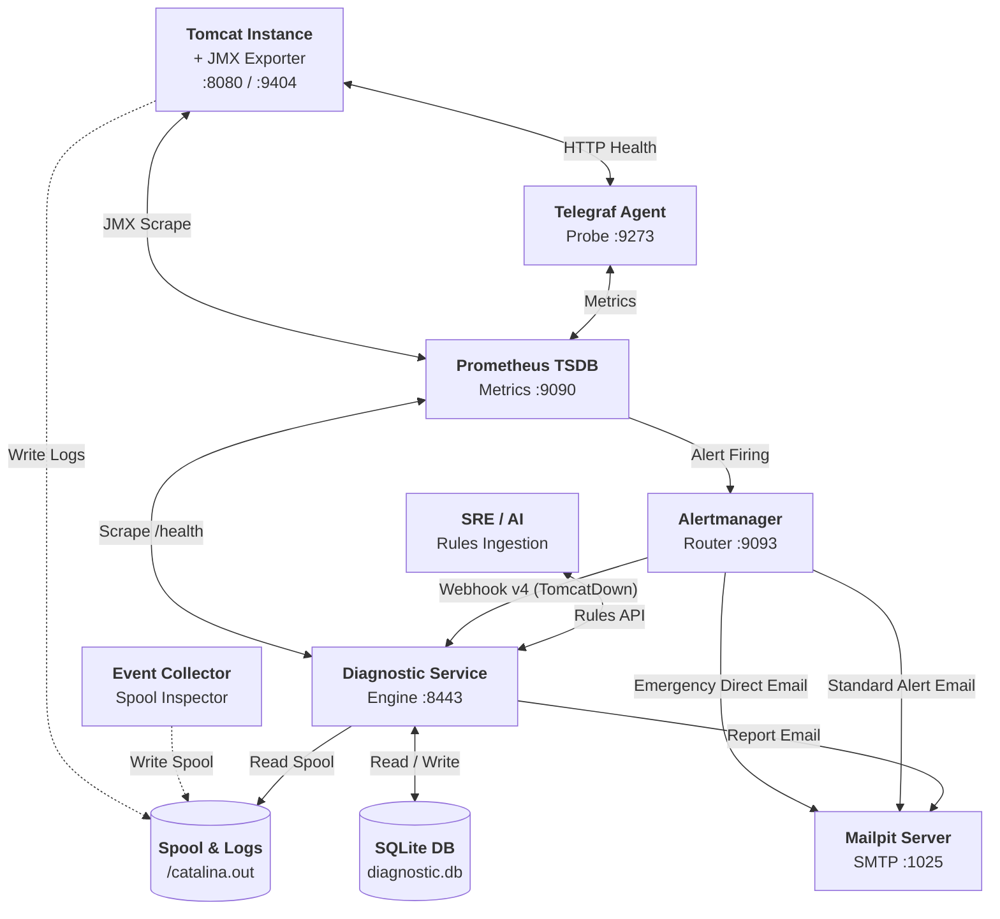

# Tomcat Monitoring & Diagnostic Automation

Repository ini berisi konfigurasi, automasi deployment, manajemen aturan deklaratif, serta interface verifikasi otomatis untuk ekosistem **Tomcat Monitoring & Diagnostic Platform**.

Stack pemantauan ini mengintegrasikan pengumpulan metrik runtime (JMX & HTTP Health), perutean alert cerdas (Alertmanager), serta analisis diagnosis otonom (*Autonomous Diagnostic Engine*) yang diperkaya oleh kecerdasan buatan (*AI-Augmented Knowledge Enrichment*).

---

## 🏛️ Topologi Arsitektur Ekosistem



### 📋 Deskripsi Komponen Utama

1. **`tomcat-jmx-exporter`:** Tomcat Instance yang dilengkapi Java Agent JMX Exporter (port 9404 HTTPS) untuk metrik JVM dan Tomcat MBeans, serta port 8080 HTTP untuk traffic aplikasi dan probe endpoint `/health`. Auto-healing: `--restart=on-failure:5`.
2. **`telegraf`:** Local HTTP health probe untuk aplikasi Tomcat (`/health`) (port 9273).
3. **`prometheus`:** Time-series TSDB, scraping JMX, Telegraf, & Diagnostic Service `/health`, serta evaluasi alert rules (`TomcatDown`, `DiagnosticServiceDown`) (port 9090). Auto-healing: `--restart=on-failure:5`.
4. **`alertmanager`:** Routing webhook cerdas ke Diagnostic Service, direct emergency routing saat Diagnostic Service down, dan email firing/resolved ke Mailpit (port 9093). Auto-healing: `--restart=on-failure:5`.
5. **`diagnostic-service`:** Core Autonomous Diagnostic Engine dengan 18 cabang diagnosis (*TD-01 s/d TD-18*) dan Rules API (port 8443). Auto-healing: `--restart=on-failure:5`.
6. **`tomcat-diagnostic-event-collector`:** Daemon `systemd --user` host-side rootless yang memantau lifecycle container Podman Tomcat, exit code, dan status OOM ke direktori spool persisten (`${HOME}/.local/share/tomcat-monitoring/spool`).
7. **`mailpit`:** Local SMTP receiver dan Web UI untuk pengujian dan verifikasi laporan diagnosis (port 8025/1025).
8. **`podman-restart.service`:** Systemd user service yang bertindak sebagai supervisor daemonless container auto-healing.

---

## 💾 Arsitektur Persistensi Data & Volume (Zero `/tmp` Policy)

Platform menerapkan standardisasi penyimpanan persisten berbasis **Podman Named Volumes** dan **Zero `/tmp` Policy** untuk seluruh komponen:

| Nama Volume / Path Persisten | Target Mount Container | Akses | Fungsi & Tanggung Jawab | Deklarasi `CONFIG` |
| :--- | :--- | :---: | :--- | :--- |
| **`tomcat_logs`** | `tomcat-jmx-exporter:/usr/local/tomcat/logs`<br/>`diagnostic-service:/run/tomcat-diagnostic/logs` | `rw,z`<br/>`ro,z` | Persistensi log audit Tomcat (`catalina.out`, access logs) dan korelasi bukti investigasi insiden | `LOG_VOLUME=tomcat_logs` |
| **`diagnostic_data`** | `diagnostic-service:/var/lib/tomcat-diagnostic` | `rw,z` | Persistensi database SQLite `diagnostic.db`, antrean insiden, custom rules, & notification state | `DATA_VOLUME=diagnostic_data` |
| **`prometheus_data`** | `prometheus:/prometheus` | `rw,z` | Persistensi time-series metrics TSDB | `PROMETHEUS_DATA_VOLUME` |
| **`alertmanager_data`** | `alertmanager:/alertmanager` | `rw,z` | Persistensi alert silences & notification logs | `ALERTMANAGER_DATA_VOLUME` |
| **`${HOME}/.local/share/tomcat-monitoring/spool`** | `diagnostic-service:/run/tomcat-diagnostic/spool` | `ro,z` | Penyimpanan spool rekaman bukti telemetri container dari daemon Event Collector (`0700`) | `DEFAULT_SPOOL_DIR` |

### Prinsip Utama Persistensi:
1. **Zero Volatile `/tmp`:** Log Tomcat dan data diagnosa tidak disimpan di direktori volatil `/tmp` agar data tidak hilang ketika container atau server host di-restart, menjamin kepatuhan retensi log audit internal.
2. **Standardisasi Named Volume:** Menghindari unmanaged bind-mount path pada host mesin lokal/pengguna, menjaga isolasi hak akses container SELinux (`:z`), dan mempermudah portability volume.
3. **Pola Konfigurasi Kanonikal (`CONFIG`):** Setiap repositori (`tomcat-jmx-exporter`, `tomcat-diagnostic-service`) memiliki file `CONFIG` sebagai single source of truth untuk nama volume dan port bawaan, dengan dukungan runtime environment variable override pada seluruh skrip deployment.

---

## 📑 Taksonomi Kategori Domain Kegagalan (Failure Domains)

Sistem mengadopsi taksonomi **8 Kategori Domain Kegagalan** untuk menstrukturkan basis pengetahuan diagnosis dan mempermudah perutean eskalasi:

| Kategori Domain (*Category Enum*) | Definisi & Cakupan Kegagalan | Pola & Gejala Tipikal (*Typical Patterns*) | Tim Eskalasi / Triage Target |
| :--- | :--- | :--- | :--- |
| **`jvm_memory`** | Kegagalan alokasi memori internal JVM, class metadata, atau batas garbage collector. | `OutOfMemoryError: Java heap space`, `Metaspace`, `GC overhead limit exceeded`, `Direct buffer memory`. | Tim Backend / Java Developer |
| **`concurrency_threading`** | Kejenuhan worker thread pool Tomcat, thread starvation, atau kondisi saling kunci (*deadlock*). | `RejectedExecutionException: Thread pool is exhausted`, `Java-level deadlock`, thread saturation. | Tim Backend / Platform Engineer |
| **`database_persistence`** | Kegagalan konektivitas, exhaustion connection pool database, timeout query, atau deadlock database. | `CannotGetJdbcConnectionException`, `HikariPool timeout`, `SQLTimeoutException`, connection leak. | Tim DBA / Database Administrator |
| **`network_integration`** | Kegagalan jabat tangan TLS/SSL, timeout komunikasi microservice upstream, atau DNS/socket failure. | `SSLHandshakeException`, `SocketTimeoutException: Read timed out`, `ConnectException: Connection refused`. | Tim Network / Cloud Infrastructure |
| **`application_lifecycle`** | Kegagalan startup container, deployment WAR, inisialisasi context aplikasi, atau runtime servlet error. | `LifecycleException: Failed to start component`, `BeanCreationException`, `ClassNotFoundException`. | Tim Application Developer |
| **`storage_os_limits`** | Batasan resource OS host, exhaustion file descriptor / process limit (ulimit), atau kapasitas disk. | `Too many open files`, `No space left on device`, `Read-only file system`, exit code container tanpa dump. | Tim Sysadmin / Infrastructure |
| **`security_session`** | Kegagalan autentikasi eksternal, otorisasi, validasi token, replikasi sesi cluster, atau filter crash. | `LDAPException`, `SessionReplicationException`, `InvalidTokenException`, CORS filter crash. | Tim Security / IAM & Middleware |
| **`general`** | Kondisi cross-domain, telemetri anomali saling bertentangan, atau klasifikasi *fallback* yang belum terpetakan. | `Contradicting state`, `Undetermined evidence`, pola kegagalan baru yang memerlukan analisis AI. | SRE / Incident Commander |

---

## 📊 Katalog Metrik Observabilitas Prometheus (Prometheus Metrics Catalog)

Prometheus mengumpulkan seluruh metrik runtime secara persisten ke dalam TSDB volume `prometheus_data` dari 3 target scrape utama:

### 1. Target: `tomcat-jmx-exporter` (`:9404/metrics` - JVM & Tomcat MBeans)

| Nama Metrik | Tipe | Deskripsi & Nilai yang Dikumpulkan | Contoh Query PromQL SRE |
| :--- | :---: | :--- | :--- |
| `jvm_memory_heap_used_bytes` | Gauge | Kapasitas memori Heap yang sedang digunakan saat ini (Bytes). | `jvm_memory_heap_used_bytes / (1024*1024)` |
| `jvm_memory_bytes_used{area="heap"}` | Gauge | Penggunaan heap memory total. | `(jvm_memory_bytes_used{area="heap"} / jvm_memory_bytes_max{area="heap"}) * 100` |
| `jvm_memory_bytes_max{area="heap"}` | Gauge | Alokasi heap maksimum JVM (`-Xmx`). | - |
| `jvm_memory_bytes_committed` | Gauge | Alokasi memori yang di-commit oleh OS kernel. | `jvm_memory_bytes_committed{area="heap"}` |
| `jvm_memory_bytes_used{area="nonheap"}`| Gauge | Penggunaan memori non-heap (Metaspace, CodeHeap). | `jvm_memory_bytes_used{area="nonheap"} / (1024*1024)` |
| `jvm_memory_pool_used_bytes` | Gauge | Penggunaan memori per pool (`G1 Eden`, `G1 Survivor`, `G1 Old Gen`, `Metaspace`). | `(jvm_memory_pool_used_bytes{pool=~".*Old.*"} / jvm_memory_pool_max_bytes{pool=~".*Old.*"}) * 100` |
| `jvm_gc_pause_seconds_max` | Gauge | Durasi jeda *Stop-The-World* (STW) maksimum saat GC (Detik). | `jvm_gc_pause_seconds_max` |
| `jvm_gc_pause_seconds_sum` | Counter | Akumulasi durasi jeda GC CPU sejak startup aplikasi. | `(rate(jvm_gc_pause_seconds_sum[5m]) * 100)` |
| `jvm_gc_pause_seconds_count` | Counter | Total frekuensi/jumlah siklus Garbage Collection. | `rate(jvm_gc_pause_seconds_count[5m])` |
| `tomcat_threads_busy_threads` | Gauge | Jumlah worker thread konektor Tomcat yang sedang aktif memproses request. | `(tomcat_threads_busy_threads / tomcat_threads_current_threads) * 100` |
| `tomcat_threads_current_threads` | Gauge | Total kapasitas worker thread pool yang dialokasikan. | `tomcat_threads_current_threads` |
| `jvm_threads_current` | Gauge | Total seluruh thread aktif di dalam proses JVM. | `jvm_threads_current` |
| `jvm_threads_deadlocked` | Gauge | Indikator kondisi deadlock thread pada JVM. | `jvm_threads_deadlocked > 0` |
| `jvm_classes_currently_loaded` | Gauge | Jumlah class Java yang sedang di-load di memori runtime. | `jvm_classes_currently_loaded` |
| `tomcat_server` | Gauge | Identitas versi server Tomcat (`version="Apache Tomcat/9.0.x"`). | `tomcat_server` |

### 2. Target: `telegraf-health` (`:9273/metrics` - Application HTTP Health)

| Nama Metrik | Tipe | Deskripsi & Nilai yang Dikumpulkan | Contoh Query PromQL SRE |
| :--- | :---: | :--- | :--- |
| `http_response_result_code` | Gauge | Status hasil probe `/health` (`0`=Success/UP, `1`=Status Mismatch, `2`=Body Mismatch, `3`=Timeout, `4`=Connection Error). | `http_response_result_code != 0` |
| `http_response_status_code` | Gauge | Kode status HTTP aktual yang dikembalikan aplikasi (`200`, `500`, `503`). | `http_response_status_code` |
| `http_response_response_time` | Gauge | Latensi respons endpoint HTTP `/health` (Detik). | `http_response_response_time` |
| `http_response_content_length` | Gauge | Ukuran payload response body dari endpoint `/health`. | `http_response_content_length` |

### 3. Target: `tomcat-diagnostic-service` (`:8443/health` - Diagnostic Service Self-Monitoring)

| Nama Metrik | Tipe | Deskripsi & Nilai yang Dikumpulkan | Contoh Query PromQL SRE |
| :--- | :---: | :--- | :--- |
| `diagnostic_service_ready` | Gauge | Kesiapan layanan diagnosis (`1`=Ready, `0`=Unavailable/Startup). | `diagnostic_service_ready == 1` |
| `diagnostic_db_size_bytes` | Gauge | Ukuran aktual database SQLite `diagnostic.db` di disk (Bytes). | `diagnostic_db_size_bytes / 1024` |
| `diagnostic_stale_locks_recovered_total` | Counter | Total task antrean macet yang berhasil dipulihkan (*Stale Lock Recovery*). | `diagnostic_stale_locks_recovered_total` |
| `diagnostic_stale_locks_exhausted_total` | Counter | Total task macet yang mencapai batas retry maksimum dan ditandai gagal. | `diagnostic_stale_locks_exhausted_total` |
| `diagnostic_records_pruned_total` | Counter | Total rekaman data historis yang dihapus oleh siklus *retention housekeeping*. | `diagnostic_records_pruned_total` |
| `diagnostic_housekeeping_runs_total` | Counter | Frekuensi eksekusi pembersihan retensi database SQLite. | `diagnostic_housekeeping_runs_total` |
| `diagnostic_notifications_sent_total` | Counter | Total email laporan diagnosis 7-seksi yang sukses dikirim ke Mailpit/SMTP. | `diagnostic_notifications_sent_total` |
| `diagnostic_notifications_failed_total` | Counter | Total email laporan diagnosis yang gagal terkirim setelah batas retry habis. | `diagnostic_notifications_failed_total` |

### 4. Metrik Universal Scrape Engine (Semua Target)

| Nama Metrik | Tipe | Deskripsi & Nilai | Contoh Query PromQL SRE |
| :--- | :---: | :--- | :--- |
| `up` | Gauge | Ketersediaan target scrape (`1`=Target Hidup, `0`=Target Mati/Unreachable). | `up == 0` |
| `scrape_duration_seconds` | Gauge | Waktu latensi yang dibutuhkan Prometheus untuk mengambil metrik dari target (Detik). | `scrape_duration_seconds > 1` |
| `scrape_samples_scraped` | Gauge | Jumlah total data sampel metrik yang dicollect per siklus scrape. | `scrape_samples_scraped` |

> 📘 **Panduan Lengkap Konfigurasi & Retensi SRE (How-To SOP):**
> Untuk panduan langkah-demi-langkah mengubah retensi data (`PROMETHEUS_RETENTION_TIME="30d"`), menyesuaikan interval scrape, menambah alert rules, dan prosedur hot-reload zero-downtime, lihat [**Prometheus Configuration Contract & SRE SOP**](config/prometheus/README.md) atau [**DevOps Handbook Prometheus Metrics Catalog**](file:///home/eddywiyatno/git/devops-handbook/docs/projects/tomcat-monitoring/references/prometheus-metrics-catalog.md#4-panduan-operasional-sre-prosedur-konfigurasi--retensi-how-to-sop).

---


## 📂 Struktur Repositori

```text
tomcat-monitoring/
├── config/                  Konfigurasi komponen monitoring:
│   ├── alertmanager/        Konfigurasi routing alertmanager.yml & email template
│   ├── jmx-exporter/        Spesifikasi metrik JVM & Tomcat MBeans (config.yml)
│   ├── prometheus/          Scrape targets, TLS truststore, & alert rules (TomcatDown)
│   ├── rules/               Curated master rulepacks (curated-production-rulepacks.json)
│   └── telegraf/            HTTP health check probe configuration (telegraf.conf)
├── fixtures/                Test fixtures & mock receivers:
│   ├── alertmanager-webhook-receiver/  Receiver fixture untuk integrasi webhook
│   ├── diagnostic-service-mailpit/     Mock assertions HTTPS/Mailpit/SQLite
│   └── tomcat-health-app/              Exploded JSP health endpoint application
├── scripts/                 Automasi deployment, CLI operasional, & testing:
│   ├── deploy-alertmanager.sh           Deploy Alertmanager container
│   ├── deploy-diagnostic-service.sh     Deploy Diagnostic Service container
│   ├── deploy-event-collector.sh        Deploy Restricted Event Collector
│   ├── deploy-prometheus.sh             Deploy Prometheus TSDB container
│   ├── deploy-telegraf.sh               Deploy Telegraf health agent
│   ├── deploy-tomcat-jmx-exporter.sh    Deploy Tomcat runtime target
│   ├── export-rules.sh                  CLI ekspor master catalog aturan aktif
│   ├── ingest-rule.sh                   CLI ingest rulepack (single / batch array)
│   ├── validate-ai-knowledge-lifecycle.sh Automated 3-scenario AI knowledge test suite
│   ├── validate-diagnostic-pipeline.sh    End-to-end diagnostic pipeline test suite
│   └── validate.sh                      Static layout & contract validator
└── validation/              Kumpulan skrip validator statis per komponen
```

---

## 🚀 Panduan Operasional & CLI Helper

### 1. Ingest Aturan Diagnosis Baru (Single / Batch Array)
Gunakan [`scripts/ingest-rule.sh`](file:///home/eddywiyatno/git/tomcat-monitoring/scripts/ingest-rule.sh) untuk mengimpor aturan hasil sintesis AI ke Diagnostic Service secara *hot-reload*:

```bash
# Ingest batch array proaktif
BEARER_TOKEN="test-token-12345" ./scripts/ingest-rule.sh config/rules/curated-production-rulepacks.json

# Ingest single rule JSON
BEARER_TOKEN="test-token-12345" ./scripts/ingest-rule.sh /tmp/rule-td19.json
```

### 2. Ekspor Master Catalog ke PC Lokal
Gunakan [`scripts/export-rules.sh`](file:///home/eddywiyatno/git/tomcat-monitoring/scripts/export-rules.sh) untuk mengekstrak basis pengetahuan aktif:

```bash
# Menampilkan ringkasan seluruh kategori aktif dan jumlah aturan
./scripts/export-rules.sh --categories

# Ekspor seluruh katalog aturan aktif ke berkas lokal
./scripts/export-rules.sh > ~/master-rules.json

# Ekspor aturan spesifik berdasarkan domain kategori
./scripts/export-rules.sh --category database_persistence
./scripts/export-rules.sh --category jvm_memory

# Ekspor aturan spesifik berdasarkan Branch ID
./scripts/export-rules.sh TD-10
```

---

## 🧪 Skrip Pengujian Otomatis (*Automated Verification Suites*)

Repository ini menyediakan rangkaian pengujian otomatis end-to-end:

### A. AI Knowledge Lifecycle & Rules API (3 Skenario)
Menguji Safe Hot-Ingestion (`TD-10`), 5-Layer Ingestion Defense (`401`, `400`, `409`, `413`, `405`), serta Knowledge & Forensic Data Export:
```bash
./scripts/validate-ai-knowledge-lifecycle.sh
```

### B. End-to-End Diagnostic Pipeline Verification
Menguji alur lengkap saat TomcatDown firing, korelasi bukti log, korelasi exit code, persistensi SQLite, dan pengiriman email Mailpit:
```bash
./scripts/validate-diagnostic-pipeline.sh
```

### C. Static Layout Validation
```bash
./scripts/validate.sh
```

---

## 📊 Matriks Status Implementasi

| Komponen / Pipeline | Status | Verifikasi Teknis |
| :--- | :---: | :--- |
| **JMX Exporter (HTTPS :9404)** | ✅ Selesai | TLS verification, `up=1` scrape target, `--restart=on-failure:5` |
| **Telegraf Health Probe (:9273)** | ✅ Selesai | Endpoint `/health` matching `{"status":"UP"}` |
| **Prometheus (:9090)** | ✅ Selesai | Alert rule `TomcatDown` firing/resolved, `--restart=on-failure:5` |
| **Alertmanager (:9093)** | ✅ Selesai | Webhook route ke Diagnostic Service & Mailpit, `--restart=on-failure:5` |
| **Diagnostic Service (:8443)** | ✅ Selesai | 18 branches (`TD-01`..`TD-18`), Rules API, `--restart=on-failure:5` |
| **Restricted Event Collector** | ✅ Selesai | Spool isolation, rate-limit, read-only |
| **Mailpit (:8025 / :1025)** | ✅ Selesai | Validasi email 7-seksi laporan investigasi & alert firing/resolved |
| **AI Knowledge Enrichment Engine**| ✅ Selesai | 100% verified via automated lifecycle suite |
| **Self-Monitoring & Emergency Route** | ✅ Selesai | Scrape `/health` & direct emergency SMTP (`TN-001` / `TM-ADR-0020`) |
| **Container Auto-Healing & Resilience** | ✅ Selesai | `--restart=on-failure:5` & `podman-restart.service` (`TN-002` / `TM-ADR-0021`) |

---

## 📖 Dokumentasi Terkait

* **DevOps Engineering Handbook:** [`devops-handbook/docs/projects/tomcat-monitoring/`](file:///home/eddywiyatno/git/devops-handbook/docs/projects/tomcat-monitoring/)
* **Operations Runbook:** [`devops-handbook/docs/projects/tomcat-monitoring/operations/ai-knowledge-enrichment-and-rule-management-runbook.md`](file:///home/eddywiyatno/git/devops-handbook/docs/projects/tomcat-monitoring/operations/ai-knowledge-enrichment-and-rule-management-runbook.md)
* **Architecture Decision Records (ADRs):** [`devops-handbook/docs/adr/tomcat-monitoring/`](file:///home/eddywiyatno/git/devops-handbook/docs/adr/tomcat-monitoring/)
* **Engineering Journals:** [`devops-handbook/docs/projects/tomcat-monitoring/engineering-journal/`](file:///home/eddywiyatno/git/devops-handbook/docs/projects/tomcat-monitoring/engineering-journal/)
