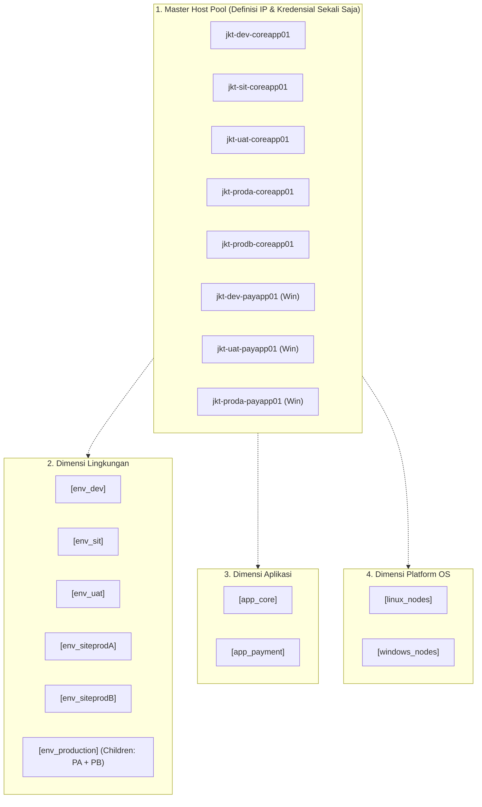

# 📋 Panduan Tata Kelola & Desain Ansible Inventory (`inventories/`)

Direktori ini berisi seluruh definisi inventori target deployment platform **Tomcat Monitoring**, mulai dari pengujian lokal (*lab*), klaster staging multi-cloud AWS, hingga arsitektur korporat on-premise berskala besar berbasis **Multi-Dimensional Matrix Grouping**.

---

## 📑 Daftar Isi

- [🏛️ Filosofi & Prinsip Desain Inventori](#️-filosofi--prinsip-desain-inventori)
- [📂 Katalog Berkas Inventori](#-katalog-berkas-inventori)
- [🧩 Pola Desain 1: Multi-Dimensional Matrix Grouping (Enterprise Standard)](#-pola-desain-1-multi-dimensional-matrix-grouping-enterprise-standard)
- [☁️ Pola Desain 2: Multi-Cloud Multi-OS Fleet (AWS Staging & Production)](#️-pola-desain-2-multi-cloud-multi-os-fleet-aws-staging--production)
- [🎯 Panduan Cheatsheet Operator: Ansible Host Pattern & Boolean Logic](#-panduan-cheatsheet-operator-ansible-host-pattern--boolean-logic)
- [⚙️ Pengelolaan Variabel Global (`group_vars/all.yml`)](#️-pengelolaan-variabel-global-group_varsallyml)
- [🧪 Validasi & Verifikasi Inventori](#-validasi--verifikasi-inventori)

---

## 🏛️ Filosofi & Prinsip Desain Inventori

Dalam arsitektur *Thin Declarative Orchestration* ([TM-ADR-0028](file:///home/eddywiyatno/git/devops-handbook/docs/adr/tomcat-monitoring/adr-records/TM-ADR-0028.md)), berkas inventori dirancang dengan prinsip:

1. **Single Source of Truth (SSOT) Definisi Host:** IP address, port, SSH credentials, dan koneksi hanya didefinisikan **1 kali** di bagian `[all_hosts]` atau grup primer. Grup-grup turunannya hanya mereferensikan nama alias host tersebut.
2. **Multi-OS Fact Branching:** Memisahkan host berdasarkan sistem operasi (`linux_nodes` vs `windows_nodes`) agar role Ansible secara otonom menyesuaikan path direktori (`~/.local/share/` vs `C:\monitoring`), manajemen credential (`0400` vs NTFS ACL), dan service manager (`systemd --user` vs Windows Service).
3. **Orthogonal Dimension Tagging:** Mendukung pemfilteran target deployment lintas aplikasi, lingkungan (*environment*), dan platform tanpa perlu merombak playbook.

---

## 📂 Katalog Berkas Inventori

| Nama Berkas | Lingkungan / Tujuan | Deskripsi & Topologi |
| :--- | :--- | :--- |
| **`lab.ini`** | Lab Lokal (`localhost`) | Node tunggal pengembang lokal menggunakan Podman rootless socket dan bridge `devops-lab`. |
| **`staging.ini`** | Pre-Production Staging | Klaster staging Linux standar. |
| **`production.ini`** | Multi-Node Production | Klaster produksi Linux multi-node standar. |
| **`production.ini.example`** | Enterprise Registry Template | Templat konfigurasi produksi dengan integrasi Enterprise Container Registry (Harbor/Nexus/Quay). |
| **`aws-staging.ini`** | AWS Cloud Staging Multi-OS | Lingkungan staging AWS EC2 multi-OS: Linux node (`98.81.129.144`) dan Windows Server 2022 node (`54.242.205.212`). |
| **`aws-production.ini`** | AWS Cloud Production Multi-OS | Lingkungan produksi armada AWS EC2 multi-node lintas Linux dan Windows. |
| **`enterprise-matrix.ini.example`** | Enterprise Datacenter / On-Premise | **Templat Standar Korporat:** Matriks multi-dimensi menggabungkan dimensi Aplikasi (`app_core`, `app_payment`), Lingkungan (`dev`, `sit`, `uat`, `siteprodA`, `siteprodB`), dan Platform (`linux_nodes`, `windows_nodes`). |
| **`group_vars/all.yml`** | Global Variables | Konfigurasi default global, registry selector, container engine selector, dan base parameters. |

---

## 🧩 Pola Desain 1: Multi-Dimensional Matrix Grouping (Enterprise Standard)

Kasus penggunaan nyata di datacenter perusahaan memiliki puluhan server dengan standarisasi penamaan hostname dan melayani berbagai aplikasi di berbagai tahapan (*Dev, SIT, UAT, Production Site A, Production Site B*).

Templat [`enterprise-matrix.ini.example`](enterprise-matrix.ini.example) memetakan topologi ini ke dalam 4 blok terstruktur:



### Contoh Penerapan di Kantor:
1. Salin berkas templat:
   ```bash
   cp inventories/enterprise-matrix.ini.example inventories/corporate-datacenter.ini
   ```
2. Sesuaikan daftar IP dan hostname pada blok `[all_hosts]`.
3. Masukkan hostname tersebut ke dalam grup lingkungan dan aplikasi yang relevan.

---

## ☁️ Pola Desain 2: Multi-Cloud Multi-OS Fleet (AWS Staging & Production)

Pada [`aws-staging.ini`](aws-staging.ini) dan [`aws-production.ini`](aws-production.ini), armada dikelompokkan berdasarkan peran fungsional stack dan arsitektur OS:

```ini
[linux_nodes]
aws-ec2-mon-01 ansible_host=98.81.129.144 ansible_user=ec2-user ansible_python_interpreter=/usr/bin/python3

[windows_nodes]
aws-ec2-win-01 ansible_host=54.242.205.212 ansible_user=Administrator ansible_connection=ssh ansible_shell_type=powershell

[monitoring_core:children]
linux_nodes

[tomcat_fleet:children]
linux_nodes
windows_nodes
```

* **`monitoring_core`:** Node Linux yang menjalankan tumpukan observability utama (Prometheus TSDB, Alertmanager, Diagnostic Service Engine, Mailpit/SMTP relay).
* **`tomcat_fleet`:** Seluruh armada target yang dipantau (Linux & Windows), tempat daemon `tm-agent` dan konfigurasi host/spool di-provisioning.

---

## 🎯 Panduan Cheatsheet Operator: Ansible Host Pattern & Boolean Logic

Operator SRE dapat mengeksekusi deployment ke target spesifik manapun melalui CLI (`--limit` / `-l`) atau parameter Jenkins UI (`TARGET_HOST`) menggunakan operator logika Boolean Ansible:

| Kebutuhan Deployment | Perintah CLI `--limit` / Parameter Jenkins | Logika Ansible | Penjelasan Hasil |
| :--- | :--- | :---: | :--- |
| **1 Host Spesifik** | `--limit jkt-proda-coreapp01` | `Eksplisit` | Menjalankan deployment hanya ke host tersebut. |
| **1 IP Spesifik** | `--limit 54.242.205.212` | `Eksplisit IP` | Menjalankan deployment ke node dengan IP tersebut. |
| **Seluruh Lingkungan SIT** | `--limit env_sit` | `Grup` | Seluruh host yang terdaftar di grup `env_sit`. |
| **Seluruh Aplikasi Payment** | `--limit app_payment` | `Grup` | Seluruh server payment di Dev, SIT, UAT, & Prod. |
| **Irisan: Payment di UAT** | `--limit "app_payment:&env_uat"` | **AND (`&`)** | Server yang ada di grup `app_payment` **DAN** di `env_uat`. |
| **Irisan: Core di Site Prod A** | `--limit "app_core:&env_siteprodA"` | **AND (`&`)** | Server yang ada di grup `app_core` **DAN** di `env_siteprodA`. |
| **Irisan: Windows di Production**| `--limit "windows_nodes:&env_production"` | **AND (`&`)** | Seluruh server Windows di Site Prod A & Site Prod B. |
| **Gabungan: DEV dan SIT** | `--limit "env_dev:env_sit"` | **OR (`:`)** | Seluruh server di Dev digabung dengan seluruh server di SIT. |
| **Negasi: Prod Tanpa Site B** | `--limit "env_production:!env_siteprodB"` | **NOT (`!`)** | Seluruh server Production **KECUALI** yang berada di Site B. |
| **Wildcard Hostname Pattern** | `--limit "jkt-prod*"` | **Wildcard (`*`)** | Seluruh server yang nama host-nya diawali `jkt-prod`. |

---

## ⚙️ Pengelolaan Variabel Global (`group_vars/all.yml`)

Berkas [`group_vars/all.yml`](group_vars/all.yml) bertindak sebagai *Single Source of Truth* untuk konfigurasi global lintas seluruh node:

```yaml
# Definisi Runtime Engine & Registry
container_engine: podman
registry_host: localhost
registry_namespace: ""
registry_tls_verify: false
image_pull_policy: IfNotPresent

# Parameter Port & TLS JMX Exporter
tomcat_jmx_port: 9404
prometheus_port: 9090
alertmanager_port: 9093
diagnostic_service_port: 8443
```

---

## 🧪 Validasi & Verifikasi Inventori

Sebelum menjalankan deployment nyata, selalu uji resolusi target menggunakan mode `--list-hosts` atau jalankan suite validasi:

```bash
# 1. Menampilkan daftar host yang cocok dengan filter limit (Simulasi Dry-Run)
bash scripts/run-ansible-playbook.sh deploy-stack.yml -i inventories/enterprise-matrix.ini.example --list-hosts --limit "app_payment:&env_uat"

# 2. Menjalankan validasi sintaks seluruh playbook dan inventori
bash scripts/validate-ansible.sh

# 3. Menjalankan validasi tata kelola platform lengkap
bash scripts/validate.sh
```
