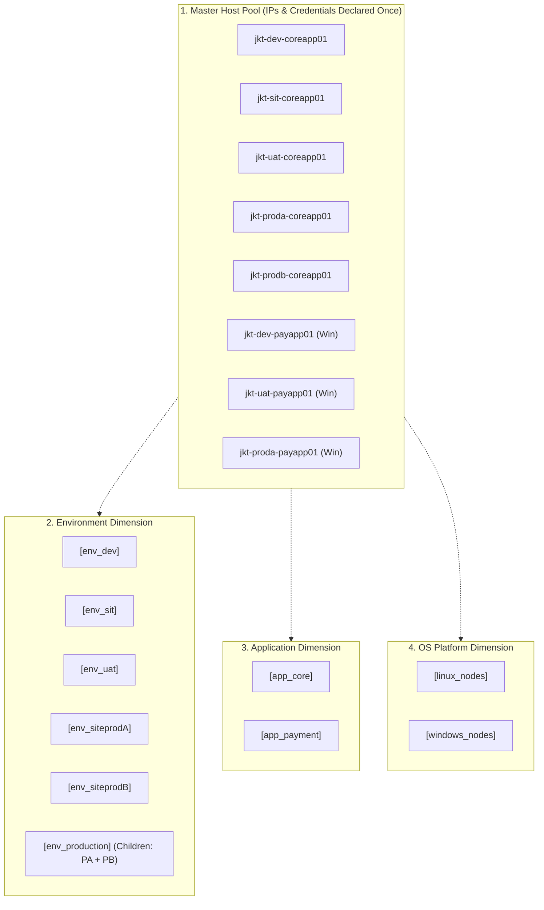

# 📋 Ansible Inventory Design & Targeting Guide (`inventories/`)

This directory maintains the inventory definitions for the **Tomcat Monitoring** platform, covering local lab environments, multi-cloud AWS staging/production clusters, and large-scale enterprise deployments based on **Multi-Dimensional Matrix Grouping**.

---

## 📑 Table of Contents

- [🏛️ Philosophy & Architectural Principles](#️-philosophy--architectural-principles)
- [📂 Inventory Catalog](#-inventory-catalog)
- [🧩 Design Pattern 1: Multi-Dimensional Matrix Grouping (Enterprise Standard)](#-design-pattern-1-multi-dimensional-matrix-grouping-enterprise-standard)
- [☁️ Design Pattern 2: Multi-Cloud Multi-OS Fleet (AWS Staging & Production)](#️-design-pattern-2-multi-cloud-multi-os-fleet-aws-staging--production)
- [🎯 SRE Operator Cheatsheet: Ansible Host Patterns & Boolean Logic](#-sre-operator-cheatsheet-ansible-host-patterns--boolean-logic)
- [⚙️ Global Variable Management (`group_vars/all.yml`)](#️-global-variable-management-group_varsallyml)
- [🧪 Inventory Validation & Verification](#-inventory-validation--verification)

---

## 🏛️ Philosophy & Architectural Principles

Under the *Thin Declarative Orchestration* architecture, inventory files are designed with three core tenets:

1. **Single Source of Truth (SSOT) Host Definition:** IP addresses, SSH ports, connection parameters, and credentials are declared **exactly once** in `[all_hosts]` or the primary group. Derivative groups reference only host aliases.
2. **Multi-OS Fact Branching:** Separates nodes by operating system (`linux_nodes` vs `windows_nodes`) so Ansible roles autonomously branch directory paths (`/opt/tm_home` or `~/.local/share/` vs `C:\tm_home`), credential management (`0400` vs NTFS ACLs), and service managers (`systemd --user` vs Windows Service / Docker container).
3. **Orthogonal Dimension Tagging:** Enables cross-target filtering across applications, environments, and operating systems without rewriting playbooks.

---

## 📂 Inventory Catalog

| File Name | Environment / Purpose | Description & Topology |
| :--- | :--- | :--- |
| **`lab.ini`** | Local Lab (`localhost`) | Single-node developer environment using Podman rootless socket and `devops-lab` bridge (safe for public Git). |
| **`enterprise-matrix.ini.example`** | Enterprise Datacenter / On-Premise | **Corporate Matrix Template:** Multi-dimensional matrix combining Application (`app_core`, `app_payment`), Environment (`dev`, `sit`, `uat`, `siteprodA`, `siteprodB`), and Platform (`linux_nodes`, `windows_nodes`). |
| **`aws-staging.ini.example`** | AWS Cloud Staging Multi-OS | Staging AWS EC2 multi-OS template: Linux node and Windows Server node. |
| **`aws-production.ini.example`** | AWS Cloud Production Multi-OS | Production multi-node fleet across Linux and Windows Server instances. |
| **`staging.ini.example`** | Pre-Production Staging | Standard Linux staging cluster template. |
| **`production.ini.example`** | Enterprise Registry Template | Production template with enterprise container registry integration (Harbor/Nexus/Quay). |
| **`group_vars/all.yml`** | Global Variables | Global defaults, container engine selectors, registry configuration, and port baselines. |

---

## 🧩 Design Pattern 1: Multi-Dimensional Matrix Grouping (Enterprise Standard)

Corporate datacenters typically manage dozens of servers across multiple applications and staging tiers (*Dev, SIT, UAT, Production Site A, Production Site B*).

[`enterprise-matrix.ini.example`](enterprise-matrix.ini.example) organizes this topology into 4 structured blocks:



### Setup Guide:
1. Copy the template:
   ```bash
   cp inventories/enterprise-matrix.ini.example inventories/corporate-datacenter.ini
   ```
2. Define server IPs and hostnames in `[all_hosts]`.
3. Map host aliases into the corresponding environment and application groups.

---

## ☁️ Design Pattern 2: Multi-Cloud Multi-OS Fleet (AWS Staging & Production)

In [`aws-staging.ini.example`](aws-staging.ini.example) and [`aws-production.ini.example`](aws-production.ini.example), nodes are grouped by functional role and OS architecture:

```ini
[linux_nodes]
aws-ec2-mon-01 ansible_host=198.51.100.10 ansible_user=ec2-user ansible_python_interpreter=/usr/bin/python3

[windows_nodes]
aws-ec2-win-01 ansible_host=198.51.100.20 ansible_user=Administrator ansible_connection=ssh ansible_shell_type=powershell

[monitoring_core:children]
linux_nodes

[tomcat_fleet:children]
linux_nodes
windows_nodes
```

* **`monitoring_core`:** Linux nodes hosting the core monitoring stack (Prometheus TSDB, Alertmanager, Diagnostic Engine, Mailpit/Postfix Relay).
* **`tomcat_fleet`:** All target nodes being monitored (Linux & Windows), where `tm-agent` daemon and host/spool directories are provisioned.

---

## 🎯 SRE Operator Cheatsheet: Ansible Host Patterns & Boolean Logic

Target specific subsets of servers via CLI (`--limit` / `-l`) or the Jenkins UI (`TARGET_HOST` parameter):

| Deployment Target Requirement | CLI `--limit` / Jenkins Parameter | Ansible Logic | Description |
| :--- | :--- | :---: | :--- |
| **Single Specific Host** | `--limit jkt-proda-coreapp01` | `Explicit` | Deploys ONLY to the specified host. |
| **Single Specific IP** | `--limit 198.51.100.20` | `Explicit IP` | Deploys ONLY to the host matching that IP. |
| **Entire SIT Environment** | `--limit env_sit` | `Group` | All hosts registered in group `env_sit`. |
| **All Payment Application Nodes**| `--limit app_payment` | `Group` | All payment servers across Dev, SIT, UAT, and Prod. |
| **Intersection: Payment in UAT** | `--limit "app_payment:&env_uat"` | **AND (`&`)** | Hosts present in `app_payment` **AND** in `env_uat`. |
| **Intersection: Core in Prod A** | `--limit "app_core:&env_siteprodA"` | **AND (`&`)** | Hosts present in `app_core` **AND** in `env_siteprodA`. |
| **Intersection: Windows in Prod**| `--limit "windows_nodes:&env_production"` | **AND (`&`)** | All Windows nodes in Prod A and Prod B. |
| **Union: DEV and SIT** | `--limit "env_dev:env_sit"` | **OR (`:`)** | All servers in Dev combined with all servers in SIT. |
| **Negation: Prod Except Site B** | `--limit "env_production:!env_siteprodB"` | **NOT (`!`)** | All Production servers **EXCEPT** those in Site B. |
| **Wildcard Pattern** | `--limit "jkt-prod*"` | **Wildcard (`*`)** | All servers whose hostname starts with `jkt-prod`. |

---

## ⚙️ Global Variable Management (`group_vars/all.yml`)

[`group_vars/all.yml`](group_vars/all.yml) defines global configuration defaults across all nodes:

```yaml
# Runtime Engine & Registry Settings
container_engine: podman
registry_host: localhost
registry_namespace: ""
registry_tls_verify: false
image_pull_policy: IfNotPresent

# Ports & Metrics Baseline
tomcat_jmx_port: 9404
prometheus_port: 9090
alertmanager_port: 9093
diagnostic_service_port: 8443
```

---

## 🧪 Inventory Validation & Verification

Always verify target host resolution before triggering changes:

```bash
# 1. Preview matching target hosts (Dry-Run Preview)
bash scripts/run-ansible-playbook.sh deploy-stack.yml -i inventories/enterprise-matrix.ini.example --list-hosts --limit "app_payment:&env_uat"

# 2. Validate playbook syntax and inventory integrity
bash scripts/validate-ansible.sh

# 3. Run complete static validation
bash scripts/validate.sh
```
